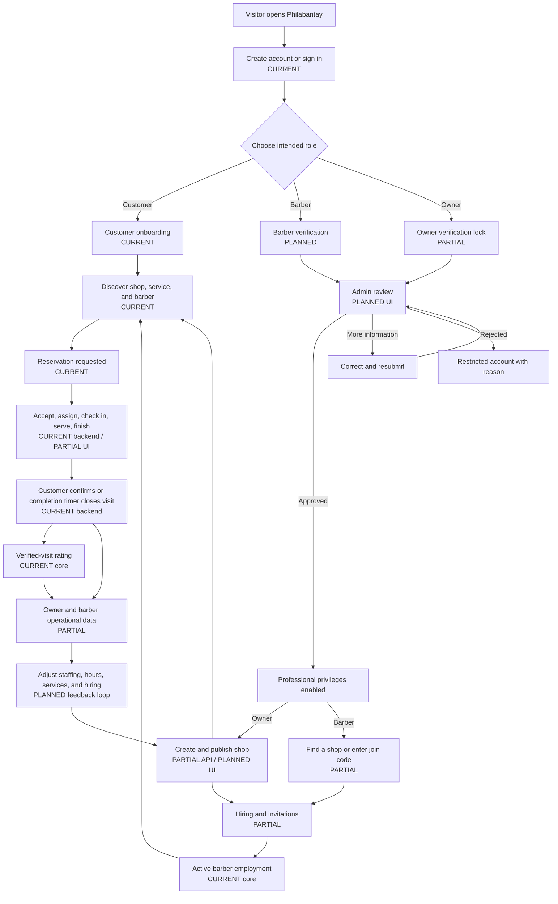
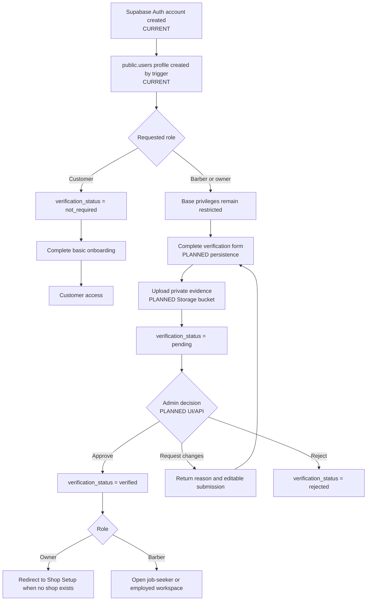
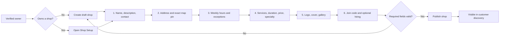
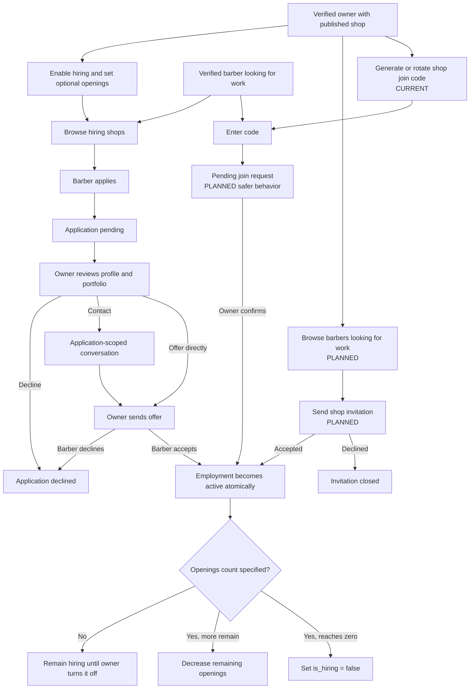
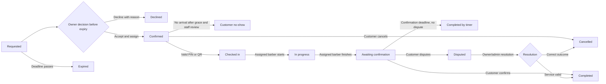
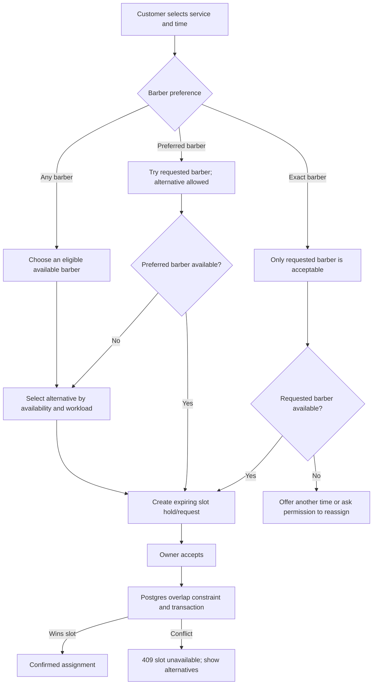
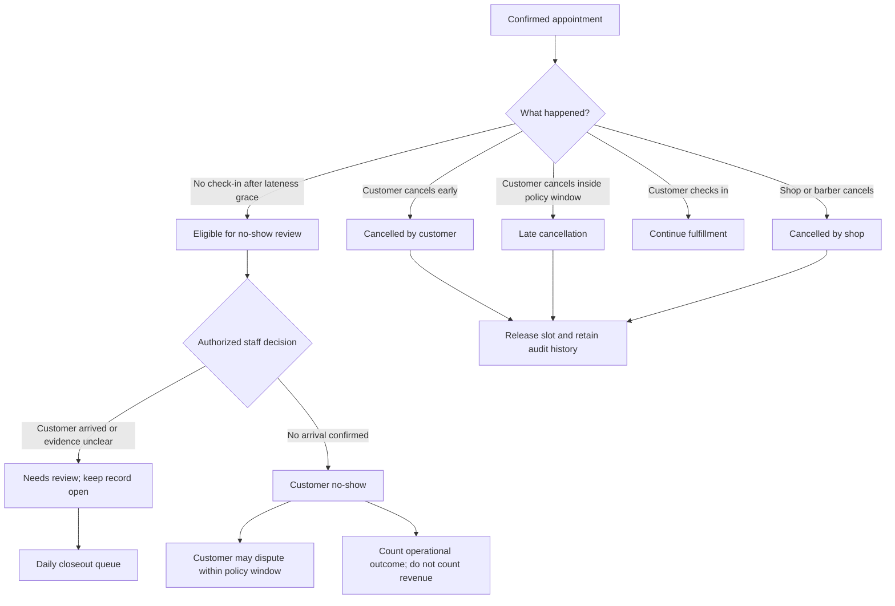
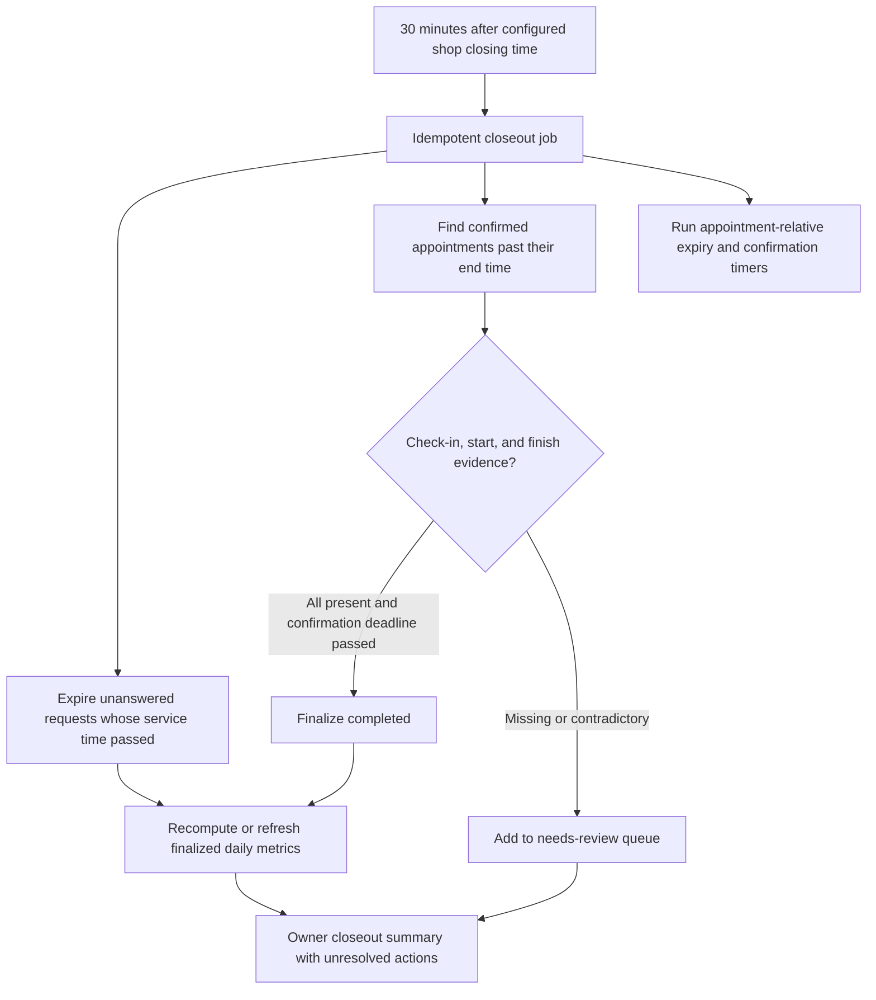
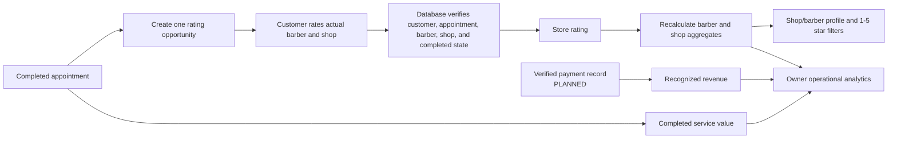

# 1. Philabantay system flowcharts

This document explains the product as a sequence of decisions and state
changes. Read it before the UML, DFD, or database documents. A box marked
**CURRENT** is backed by the repository today; **PARTIAL** means only part of
the path exists; **PLANNED** is the intended behavior.

## 1.1 Whole-product journey

The central idea is a feedback loop. Shop configuration makes discovery and
booking possible; completed visits generate trusted history; that history helps
the owner improve configuration and staffing. A chart is never the source of
truth—it is a view over finalized operational records.

## 1.2 Account and verification flow

Security rule: selecting a role in the browser is only a request. The browser
cannot approve it. Express authorization and Postgres RLS must both see a
verified server-side profile before professional operations are permitted.

The repository already locks unverified owners out of operational routes, but
it does not yet have a complete verification-submission table, evidence bucket,
or admin review screen. Those pieces are explicitly planned rather than implied.

## 1.3 Owner shop setup and publishing

The current API can create and update basic shop rows and services. The full
owner wizard, draft/published state, operating-hours storage, photos, and hiring
fields on the shop are planned extensions.

Publishing is different from verification: verification proves the owner;
publishing proves the shop profile has enough information for customers.

## 1.4 Hiring, application, invitation, and join-code flow

Today, hiring is represented by a one-to-one `hiring_listings` table, and the
barber map already filters open listings. The target design consolidates the
status and optional metadata onto the shop, or otherwise guarantees a single
authoritative source. The real API also needs atomic opening-count updates; the
mock and API currently differ.

Recommended join-code rule: a code identifies the shop but does not bypass
verification or owner approval. This prevents a leaked reusable code from
silently adding staff.

## 1.5 Reservation and fulfillment lifecycle

This canonical lifecycle is substantially implemented in the Supabase
migrations and Express command routes. Every command uses an expected version,
locks the appointment row, re-checks actor and state, and writes an immutable
appointment event in the same transaction.

The database does not infer that a physical haircut occurred. Completion needs
evidence: check-in, start, finish, customer confirmation, or an audited timeout.

## 1.6 Barber preference and assignment

The existing data model records a single barber on an appointment but does not
yet distinguish exact, preferred, and any-barber intent. That preference must be
stored if automatic assignment is added; otherwise the owner could replace an
exact request without consent.

## 1.7 Cancellation, late arrival, and no-show handling

No cancellation or no-show is physically deleted. “Trash” in the interface
must mean archived from the active queue, never removed from the transactional
history.

## 1.8 Daily closeout and reconciliation

Appointment-relative timers remain authoritative. The shop-close job is a
reconciliation safety net; it must not cancel a legitimate service that runs
past posted closing time.

## 1.9 Rating and analytics flow

The current database correctly ties a rating to a completed appointment and
updates aggregates. It does not yet model payment, so current revenue charts
must be described as completed service value or estimates—not collected money.

## 1.10 Invariants shared by every flow

1. The browser proposes; Express and Postgres decide.
2. Every shop-scoped action carries or resolves a shop ID and verifies
   ownership or active membership.
3. State-changing commands are idempotent or protected by an expected version.
4. Human-world events require human or device evidence; absence of data is not
   proof of completion or misconduct.
5. Historical transactions are retained. UI archives are views, not deletes.
6. Analytics count only states whose meaning is finalized and documented.
7. Planned functionality stays visibly labeled until tests prove it works.
