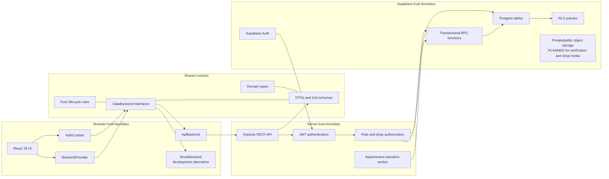
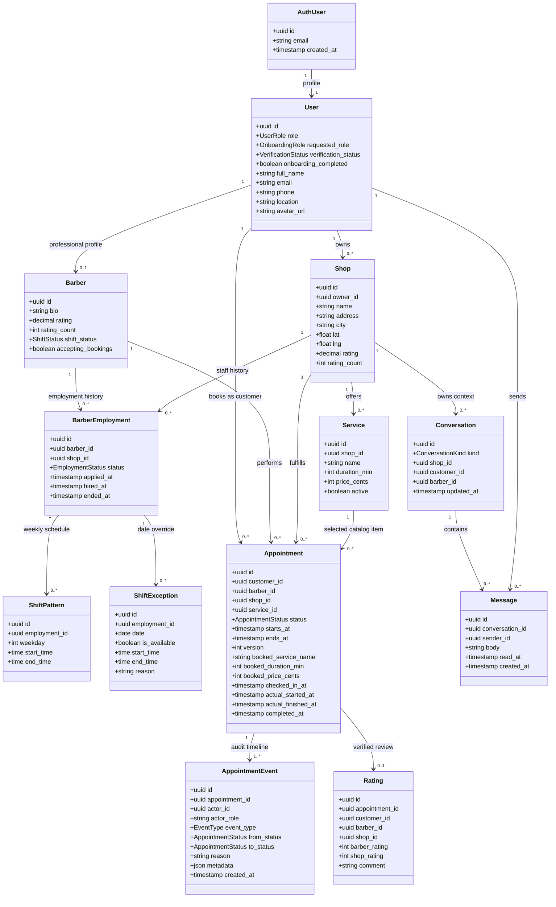
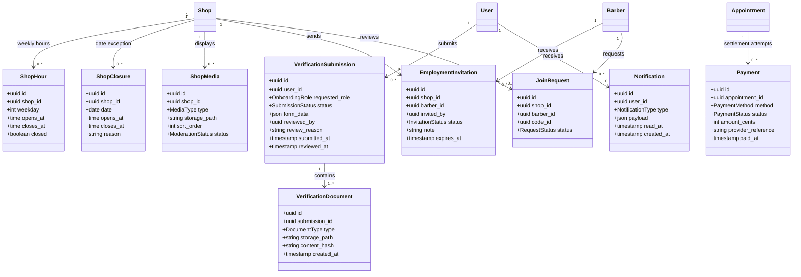
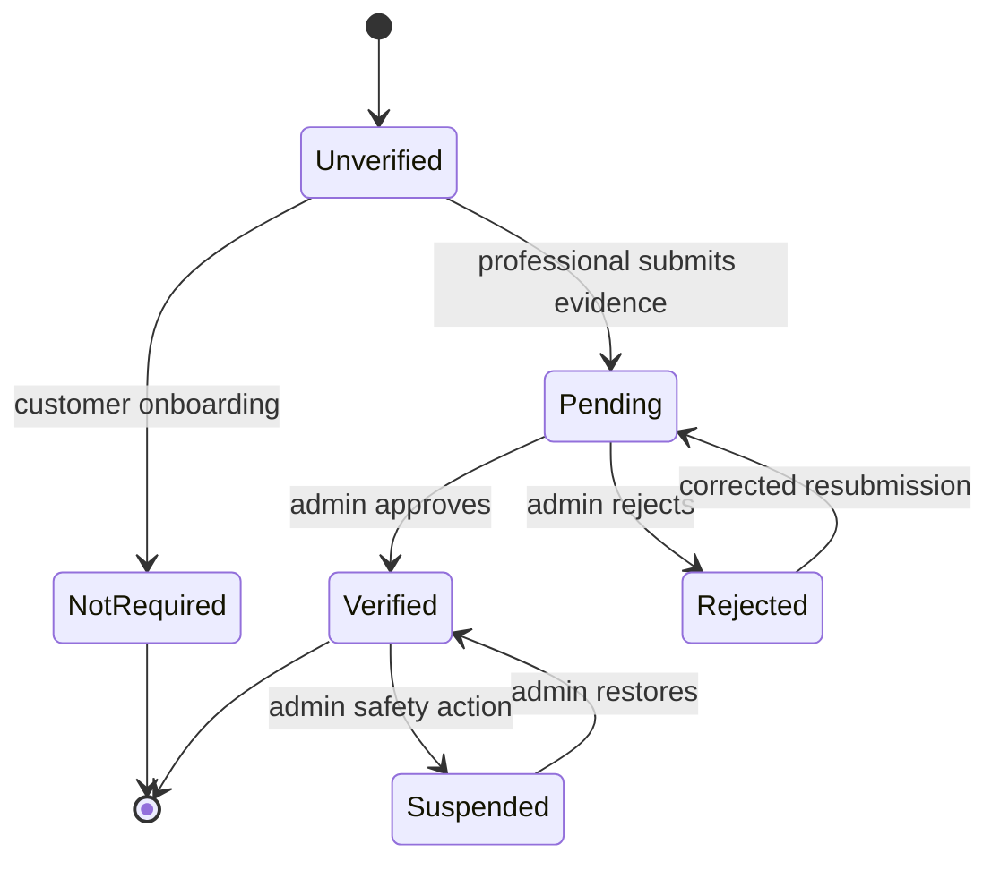
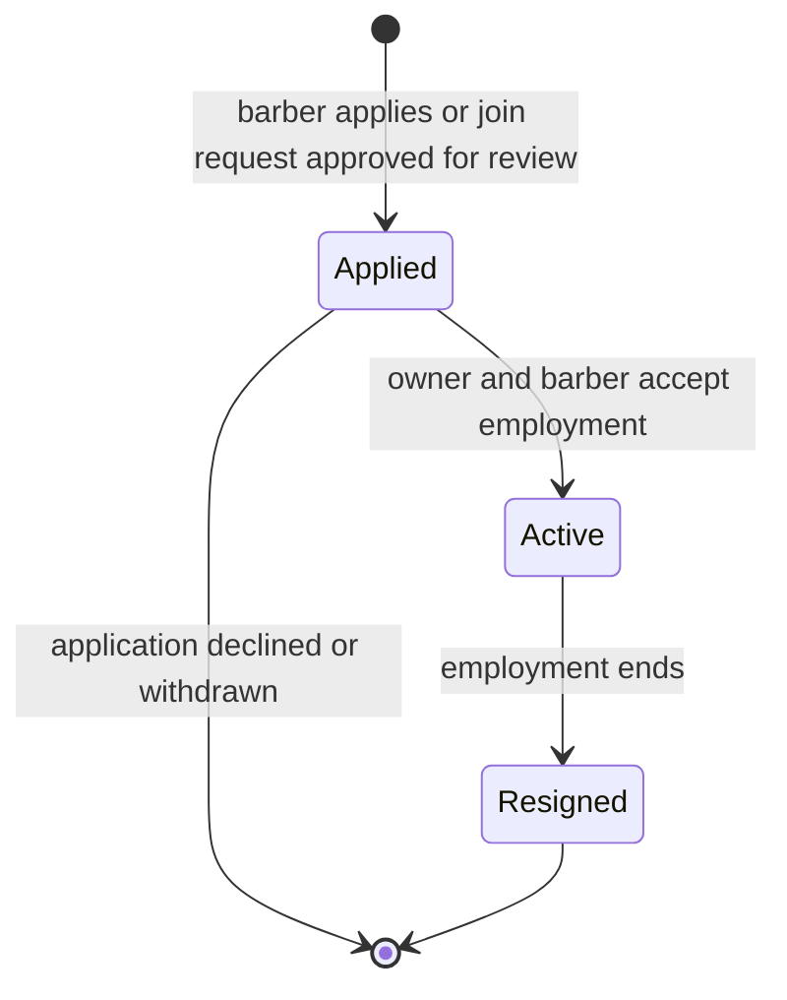
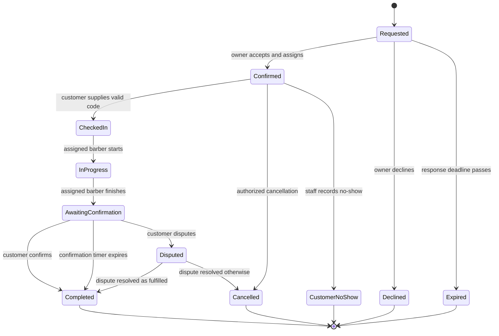
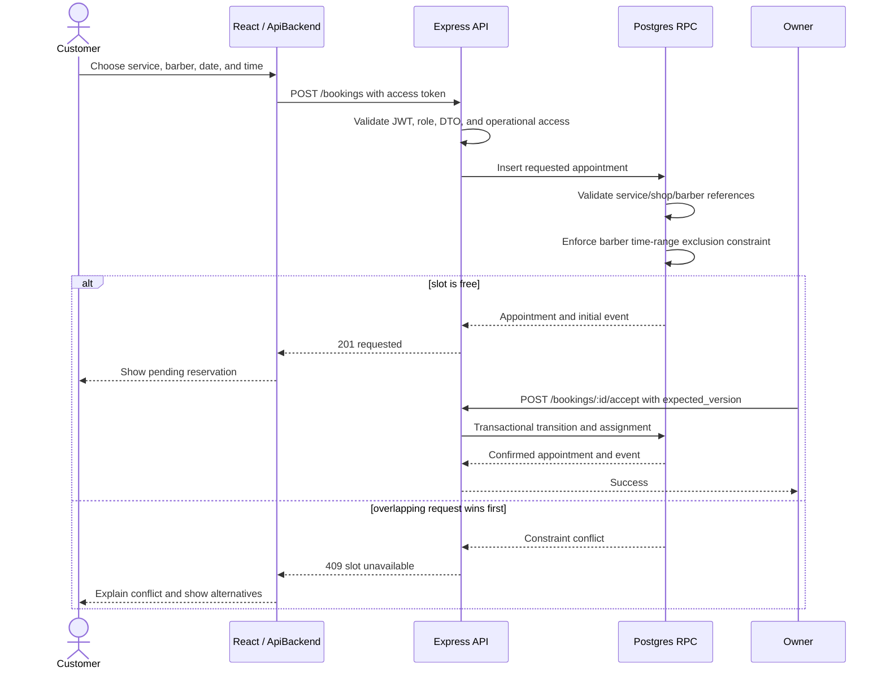
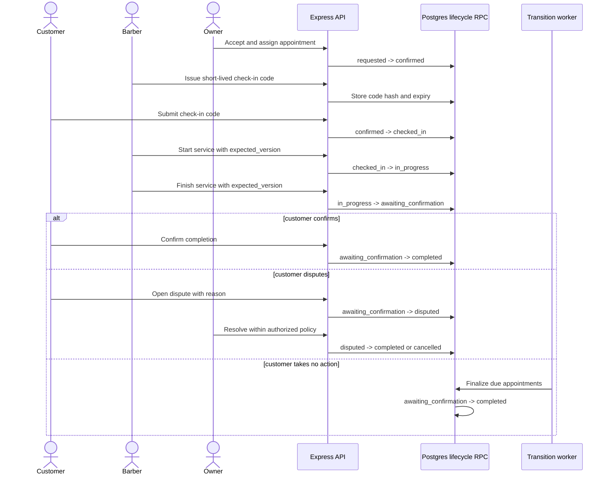

# 2. UML and domain model

This document translates the flowcharts into software structure. The diagrams
use UML-style Mermaid notation so Git hosting, editors, and documentation tools
can render them without separate image files.

## 2.1 System component diagram

Read the arrows from the browser toward durable data: UI calls the shared
backend contract, Express applies request and authorization rules, and Postgres
performs the final transactional and tenant-isolation checks.

### Responsibility rule

- React owns presentation, local interaction state, and helpful button hiding.
- `packages/shared` owns contracts and reusable business decisions.
- Express owns request validation and the first authorization layer.
- Postgres owns durable invariants, row-level isolation, concurrency, and
  transactional state changes.
- Supabase Auth owns credentials and sessions.
- The service-role credential exists only on the server.

## 2.2 Current core domain class diagram

The core model has four ownership anchors: an authenticated profile, a shop, an
employment stint, and an appointment. Events and snapshots preserve history so
later profile, service, or staffing edits cannot rewrite an earlier visit.

### Why the appointment stores snapshots

`service_id` links to the current service catalog, but the appointment also
stores the booked name, duration, and price. If an owner edits “Classic Cut”
from PHP 250 to PHP 300 tomorrow, yesterday’s history must remain PHP 250.

### Why employment is a history table

A barber can work for different shops over time. Attendance, schedules, staff
notes, and performance must remain attached to the correct employment stint
instead of silently moving when the barber changes shops.

## 2.3 Supporting workforce and engagement classes

```mermaid
classDiagram
    class User
    class Shop
    class Barber
    class Appointment

    class BarberApplication {
        +uuid id
        +uuid barber_id
        +uuid shop_id
        +ApplicationStatus status
        +timestamp created_at
    }

    class HiringListing {
        +uuid shop_id
        +string role_title
        +EmploymentType employment_type
        +string[] requirements
        +int open_positions
        +boolean accepting_applications
    }

    class ShopJoinCode {
        +uuid shop_id
        +string code
        +timestamp rotated_at
    }

    class AttendanceRecord {
        +uuid id
        +uuid employment_id
        +uuid barber_id
        +uuid shop_id
        +date date
        +AttendanceStatus status
        +uuid recorded_by
        +string notes
    }

    class ShiftChangeRequest {
        +uuid id
        +uuid employment_id
        +date date
        +string message
        +RequestStatus status
    }

    class StaffNote {
        +uuid id
        +uuid shop_id
        +uuid barber_id
        +uuid author_id
        +string body
    }

    class NotificationPreference {
        +uuid user_id
        +boolean booking_reminders
        +boolean chat_notifications
        +boolean email_updates
        +boolean nearby_alerts
    }

    class FavoriteShop {
        +uuid user_id
        +uuid shop_id
    }

    class FavoriteBarber {
        +uuid user_id
        +uuid barber_id
    }

    HiringListing "1" --> "1" Shop : extends
    BarberApplication "0..*" --> "1" Shop : targets
    BarberApplication "0..*" --> "1" Barber : submitted by
    ShopJoinCode "1" --> "1" Shop : grants join context
    AttendanceRecord "0..*" --> "1" BarberEmployment : belongs to
    ShiftChangeRequest "0..*" --> "1" BarberEmployment : requests change to
    StaffNote "0..*" --> "1" Shop : private to
    StaffNote "0..*" --> "1" Barber : concerns
    NotificationPreference "1" --> "1" User : owned by
    FavoriteShop "0..*" --> "1" User : saved by
    FavoriteShop "0..*" --> "1" Shop : saves
    FavoriteBarber "0..*" --> "1" User : saved by
    FavoriteBarber "0..*" --> "1" Barber : saves
```

`HiringListing` is current. The planned hiring redesign may migrate its status
and metadata onto `Shop`; see the database design for the compatibility plan.

## 2.4 Planned extension classes

These classes describe missing product capabilities. They are not current
tables and must not be used as evidence that a feature exists.

These planned records separate reviewable evidence, public shop presentation,
employment invitations, payment evidence, and durable notifications from the
existing core tables. Keeping them separate avoids putting unrelated lifecycle
states into a single JSON field and makes RLS easier to reason about.

## 2.5 Verification state machine

Role and verification are separate facts. A user can request owner onboarding
without being a verified owner. Authorization should require both the correct
effective role and the correct verification status.

## 2.6 Employment state machine

The current database uses `applied`, `active`, and `resigned`. Invitations and
safer join requests are planned coordination records that eventually create or
transition this authoritative employment record.

## 2.7 Appointment state machine

No arbitrary `PATCH status` should bypass this machine. The explicit command
endpoints and transactional RPC functions are the authoritative transition
mechanism.

## 2.8 Booking sequence with concurrency protection

The database exclusion constraint is the final defense against two customers
winning the same barber and time range. The API converts that database conflict
into a stable `409` response; the UI should refresh availability instead of
pretending the earlier screen was still authoritative.

## 2.9 Check-in and completion sequence

The service is not considered completed when the barber merely taps Finish.
Finish opens a confirmation window; customer confirmation or the controlled
timeout closes it, while a dispute preserves an auditable review path.

## 2.10 Aggregate ownership

Use these boundaries when deciding where a mutation belongs:

| Aggregate | Root | Mutations that must be atomic |
| --- | --- | --- |
| Account verification | `users` / planned submission | Submit, review, grant or restrict operational role. |
| Shop catalog | `shops` | Publish, update public identity, hiring status, hours, and media references. |
| Employment | `barber_employment` | Accept application/invitation, activate one shop, end previous stint, consume opening. |
| Appointment | `appointments` | Assign, transition status, snapshot service, record event, protect version and time slot. |
| Conversation | `conversations` | Validate participant and append message. |
| Rating | `ratings` | Verify completed appointment and refresh both aggregates. |
| Payment | planned `payments` | Verify provider/cash evidence and recognize revenue exactly once. |
