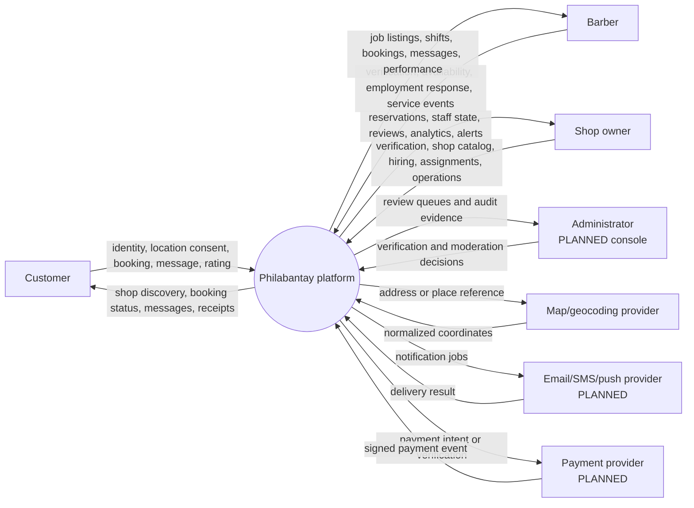
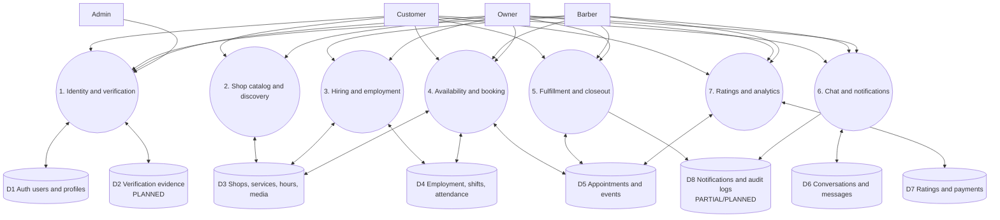
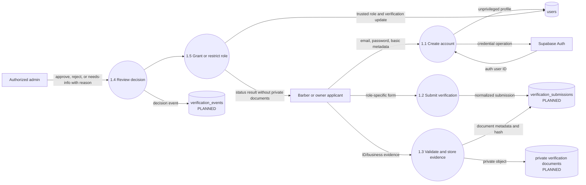
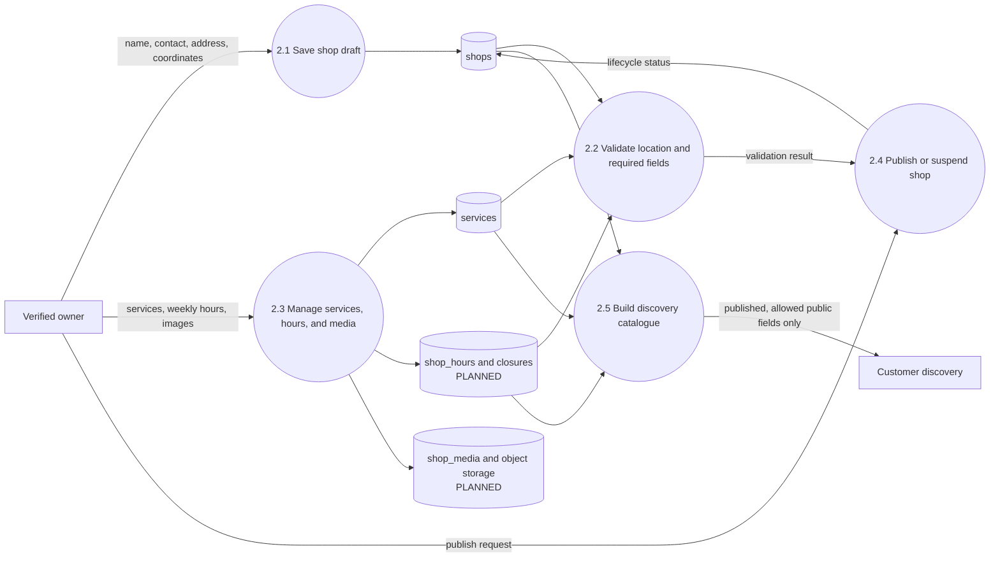
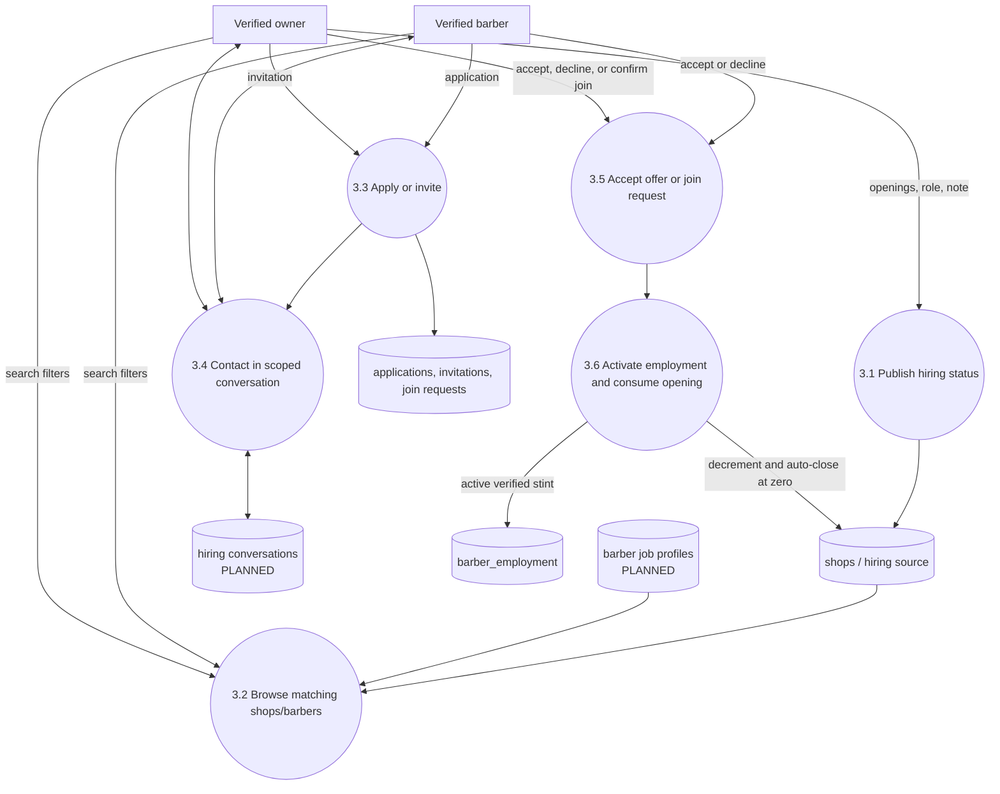
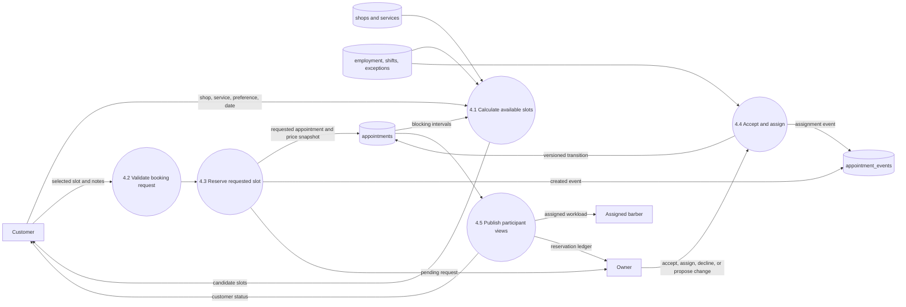
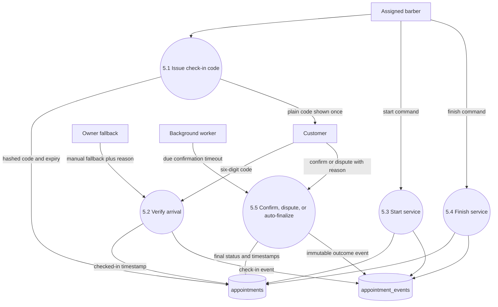
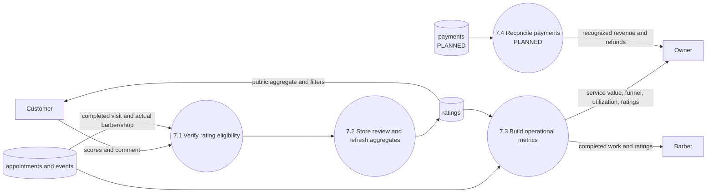
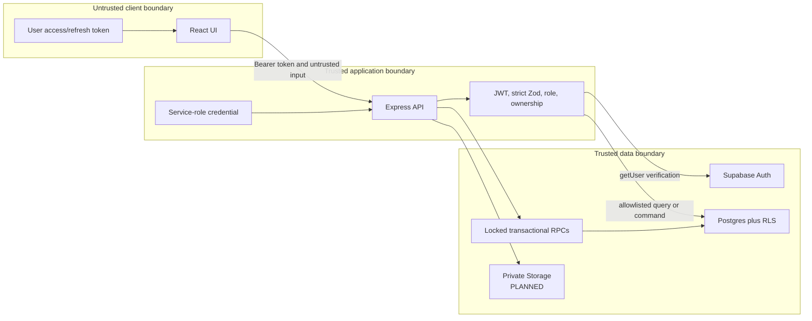

# 3. Data-flow diagrams

A data-flow diagram (DFD) answers a different question from a flowchart. A
flowchart asks “what happens next?” A DFD asks “what data enters, where is it
validated, where is it stored, and who may receive it?”

Notation used here:

- Rectangles are people or external systems.
- Rounded nodes are Philabantay processes.
- Cylinder-shaped nodes are durable data stores.
- Arrow labels name the data—not merely the action.

## 3.1 Context diagram — DFD Level 0

Purpose: establish the system boundary. Customers, barbers, owners, and admins
do not access one another’s records directly. All flows enter Philabantay and
are subjected to authentication, authorization, validation, and database
policy.

Current external integration is limited: OpenStreetMap tiles are used by the
browser. Notification delivery and payments are planned, and address
geocoding/server validation is not yet authoritative.

## 3.2 Platform decomposition — DFD Level 1

Explanation:

- Process 1 establishes who a person is and what they may do.
- Process 2 controls public shop facts; it must not publish incomplete or
  suspended shops.
- Process 3 turns applications, invitations, or approved join requests into an
  employment record.
- Processes 4 and 5 separate scheduling from physical fulfillment. A reserved
  slot is not proof of a completed service.
- Process 6 keeps participant-scoped communication separate from operational
  records.
- Process 7 reads finalized facts. It does not invent revenue or ratings.

## 3.3 Identity and professional verification — DFD Level 2

Security rules:

1. Passwords stay in Supabase Auth and never enter application tables.
2. Evidence objects are private and accessed through short-lived reviewer URLs.
3. Applicants can read their own submission status but not reviewer-only notes
   or another applicant’s evidence.
4. Only the trusted approval process may write effective role and verified
   status.
5. Every decision is append-only in the audit stream.

The current database has the `users.verification_status` field and an owner
operational lock but not the three planned verification stores shown above.

## 3.4 Shop setup and publication — DFD Level 2

Current risk: every stored shop is readable because no draft/published lifecycle
exists. The target catalogue must filter at the database/API layer; hiding a
draft only in React is insufficient.

## 3.5 Hiring and employment activation — DFD Level 2

The activation and opening decrement must be one transaction. Two accepted
offers cannot both consume the final opening, and a failed employment insert
must not decrease the count.

## 3.6 Booking request and assignment — DFD Level 2

The database already prevents overlapping active appointments for the same
barber. The target design must additionally persist exact/preferred/any-barber
intent and protect customers from overlapping their own bookings.

## 3.7 Physical fulfillment and completion — DFD Level 2

The plain check-in code is never stored. Only its hash and expiry are durable.
Completion without customer action is allowed only after the documented
finished-service evidence and timeout.

## 3.8 Rating, reporting, and financial truth — DFD Level 2

Current dashboards can derive completed booked-service value. They cannot claim
collected revenue because the payment store and reconciliation process do not
exist yet.

## 3.9 Trust-boundary overlay

The service role bypasses RLS and therefore never belongs in the browser. Every
service-role query must be preceded by Express authorization or encapsulated in
an RPC that repeats actor and ownership checks. RLS remains essential because
authenticated Supabase tokens could otherwise access Postgres directly.
