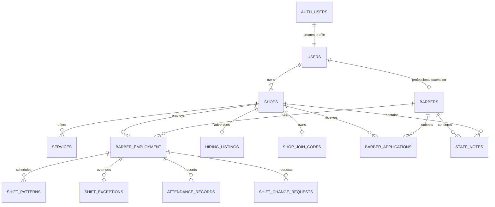
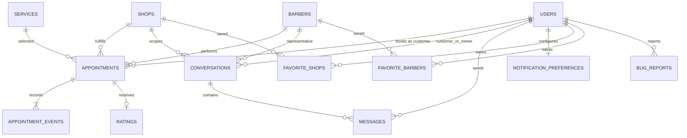
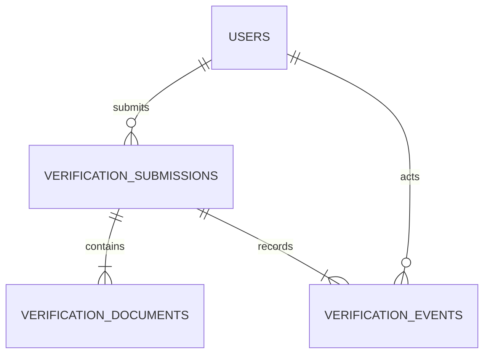

# 5. Database design

This document separates the **current schema** from the **target schema**.
Current facts come from versioned files in `supabase/migrations/`; target tables
and columns are proposals required by the workflows in this documentation.

## 5.1 Database principles

1. Supabase Auth owns passwords and authentication identities.
2. `public.users.id` mirrors `auth.users.id` and stores application profile and
   authorization state.
3. Every public application table has Row Level Security enabled.
4. Shop ownership and active employment define tenant access.
5. Express uses a server-only service role, so every route must authorize before
   querying and critical RPC functions must repeat state/actor checks.
6. Historical transactions use snapshots and append-only events.
7. Database constraints—not a prior browser/API “is free?” check—settle races.
8. Planned facts are added through migrations; never through manual dashboard
   changes.

## 5.2 Current migration chain

| Migration | Purpose |
| --- | --- |
| `20260717000100_initial_domain_schema.sql` | Core types, 21 initial public tables, foreign keys, indexes, and constraints. |
| `20260717000200_domain_functions_and_triggers.sql` | Auth profile sync, domain validation, timestamps, messaging and rating triggers. |
| `20260717000300_row_level_security.sql` | RLS, grants, and role/participant/shop policies. |
| `20260717000400_api_write_transactions.sql` | Transactional shift and employment/application RPCs. |
| `20260717000500_service_role_privileges.sql` | Explicit service-role privileges. |
| `20260717000600_lock_attendance_to_owner.sql` | Makes attendance mutation owner-controlled. |
| `20260717000700_lock_unverified_owner_accounts.sql` | Restricts owner applicants until verified. |
| `20260718000100_appointment_lifecycle.sql` | Canonical lifecycle, events, snapshots, concurrency, check-in, and due-transition RPCs. |
| `20260718000200_customer_operational_access_fix.sql` | Corrects NULL behavior for ordinary customers. |
| `20260718000300_appointment_stale_error_code.sql` | Normalizes stale-version conflict signaling. |
| `20260718000400_owner_reassign_appointment.sql` | Adds atomic owner reassignment. |

## 5.3 Current entity relationships

### Identity, catalog, and employment



This view shows which records establish identity, public shop offerings, and
the barber-to-shop employment boundary. Schedules and staff operations belong
to an employment stint, while services and hiring belong to the shop.

### Appointments, chat, and trust



This view follows activity generated after discovery: reservations create an
auditable visit history, conversations hold participant-scoped messages, and
only eligible completed appointments can produce ratings.

## 5.4 Current table catalogue

All tables below are **CURRENT** and RLS-enabled.

| Table | Purpose and important fields | Ownership / sensitivity |
| --- | --- | --- |
| `users` | Auth-linked profile, effective `role`, requested role, verification state, onboarding state, private contact/location/avatar. | User reads own private profile. Role and verification are trusted fields, not normal profile edits. |
| `barbers` | Professional extension, bio, aggregate rating/count, shift status, accepting-bookings flag. | Public catalogue fields are readable; mutation is barber/authorized server scoped. |
| `shops` | Owner, public identity/address/city/coordinates and aggregate rating/count. | Owner-scoped writes. Missing draft/publication state means every stored shop is currently catalogue-visible. |
| `services` | Shop-scoped service name, duration, price in cents, active flag. | Active catalogue reads; owner-scoped writes. |
| `barber_employment` | Barber-to-shop stint with `applied`, `active`, or `resigned`, plus applied/hired/ended dates. | Subject barber and shop owner. Only one active stint per barber. |
| `shift_patterns` | Employment-scoped weekday/start/end blocks. | Barber and owner access currently overlap; target ownership policy needs clarification. |
| `shift_exceptions` | Employment-scoped date override and private reason. | Subject barber and owner; private reasons must never enter public availability results. |
| `appointments` | Participants, schedule, canonical lifecycle, version, reasons/timestamps, check-in-code hash, and immutable booked-service snapshot. | Customer, assigned barber, owning shop. Highly sensitive operational history. |
| `appointment_events` | Immutable actor, event, previous/new state, reason, metadata, timestamp. | Same appointment participants; server-only writes. |
| `attendance_records` | Employment/day present or absent, owner recorder, notes. | Barber reads own; owner manages shop records. |
| `conversations` | Customer-shop or staff thread context. | Validated participant and shop owner. |
| `messages` | Conversation sender, text body, read and created timestamps. | Conversation participants only. |
| `ratings` | One completed-visit review containing barber score, shop score, and optional comment. | Customer creates for own completed visit; catalogue aggregates are public. |
| `barber_applications` | Barber application to a shop with pending/accepted/declined state. | Applicant and target owner. |
| `notification_preferences` | Reminder/chat/email/nearby preferences. | User-only; delivery system does not yet exist. |
| `hiring_listings` | One shop listing with role, employment type, requirements, opening count and accepting flag. | Active listings readable to authenticated users; owner manages. |
| `shop_join_codes` | One rotatable code per shop. | Owner-only read/manage. Current code is reusable and directly activates employment through Express. |
| `shift_change_requests` | Employment/date request text and decision status. | Subject barber and owner. |
| `staff_notes` | Private note about a barber in one shop, with author. | Shop-scoped private data. |
| `favorite_shops` | User-to-shop saved relationship. | User-only. |
| `favorite_barbers` | User-to-barber saved relationship. | User-only. |
| `bug_reports` | Reporter, category, description, page, metadata and status fields. | Reporter insert; operational review requires trusted tooling. |

## 5.5 Current integrity and concurrency safeguards

### Appointment overlap

Postgres uses a GiST exclusion constraint equivalent to:

```sql
exclude using gist (
  barber_id with =,
  tstzrange(starts_at, ends_at, '[)') with &&
)
where (status in (
  'requested', 'confirmed', 'checked_in',
  'in_progress', 'awaiting_confirmation'
));
```

Only one active appointment interval can occupy a barber. Near-simultaneous
requests are settled by the database; one succeeds and the other returns a
conflict. A planned customer-overlap constraint should prevent a customer from
holding overlapping active visits as well.

### Versioned lifecycle writes

Appointment commands provide `expected_version`. The RPC locks the row, rejects
a stale version, verifies actor and transition, updates the appointment, and
inserts an event atomically. This prevents two tabs or actors from silently
overwriting one another.

### Referential and historical truth

- A service and appointment shop must match.
- Shift/attendance records reference a real employment stint.
- Employment activation requires a verified granted barber at insert time.
- Ratings must match the completed appointment’s customer, barber, and shop.
- One rating exists per appointment.
- Service name, duration, and price are copied into the appointment.
- Rating aggregates are refreshed by database logic.

## 5.6 Current schema gaps that affect workflows

| Gap | Consequence |
| --- | --- |
| `appointments.barber_id` is mandatory | An “any available barber” request cannot remain unassigned. |
| No customer-overlap constraint | A customer may theoretically hold two overlapping active visits. |
| No shop hours/closures | Postgres cannot prove a booking is inside operating hours. |
| No shop lifecycle/publication state | Draft, rejected, or suspended shop records cannot be reliably hidden. |
| No verification submissions/documents/events | Professional approval cannot be completed or audited normally. |
| No payment table | Dashboard totals are service value, not collected revenue. |
| No closeout/attention records | Uncertain stale appointments have no durable review queue. |
| No notification outbox/delivery | Preferences do not send reminders. |
| No job-seeker profile/invitation/join request | Hiring supports only applications plus direct reusable code activation. |
| Employment membership does not re-check later suspension everywhere | A suspended barber could remain an active database-level shop member. |
| Service/availability shared types omit some DB scope fields | Adapter code can lose explicit shop/employment context. |

## 5.7 Target verification schema — PLANNED



One applicant may resubmit over time, each submission owns its private evidence,
and every reviewer decision becomes a separate audit event. The public profile
stores only the resulting status—not the uploaded identity documents.

### `verification_submissions`

| Column | Design |
| --- | --- |
| `id` | UUID primary key. |
| `user_id` | Applicant; indexed and FK to `users`. |
| `requested_role` | `barber` or `shop_owner`; customer never uses this table. |
| `status` | `draft`, `pending`, `needs_information`, `approved`, `rejected`, `withdrawn`. |
| `legal_name` | Private reviewed value. |
| `form_data` | Versioned allowlisted JSON for role-specific details; do not put file bytes here. |
| `submitted_at`, `reviewed_at` | Lifecycle timestamps. |
| `reviewed_by` | Admin user; cannot equal applicant. |
| `review_reason` | Required for needs-information/rejection/suspension decisions. |
| `version` | Optimistic concurrency for edits/review. |

### `verification_documents`

Stores document type, private storage path, detected MIME type, size, SHA-256,
scan state, and upload timestamp. It never stores a permanent public URL.

### `verification_events`

Append-only record of submission, resubmission, review, approval, rejection,
suspension, restoration, actor, reason, and timestamp.

Required constraints and transaction:

1. At most one active pending/needs-information submission per role/user.
2. Applicant cannot review their own submission.
3. Approval event, profile role/verification update, and professional extension
   creation occur in one trusted transaction.
4. Private documents follow an approved retention schedule.

## 5.8 Target shop and hiring schema — PLANNED

### Proposed `shops` additions

```text
lifecycle_status              draft | pending_review | published | suspended | archived
description                   nullable public text
contact_phone                 nullable public business contact
timezone                      required IANA zone, default Asia/Manila for initial market
place_id                      normalized geocoder/provider reference
location_verified_at          nullable timestamp
published_at                  nullable timestamp
is_hiring                     boolean default false
hiring_open_positions         nullable integer; NULL means unspecified
hiring_note                   nullable public text, max 280
hiring_role_title             nullable text
hiring_employment_type        nullable employment_type
hiring_requirements           text[] default empty
hiring_updated_at             nullable timestamp
closeout_grace_minutes        integer default 30
```

Suggested constraints:

```sql
check (hiring_open_positions is null or hiring_open_positions >= 0)
check (not is_hiring or hiring_open_positions is null or hiring_open_positions > 0)
check (hiring_note is null or char_length(hiring_note) <= 280)
check (published_at is not null or lifecycle_status <> 'published')
```

The existing `hiring_listings` data must be migrated into these columns before
the table is retired. Do not maintain two writable hiring sources.

### Supporting shop tables

| Table | Purpose |
| --- | --- |
| `shop_operating_hours` | Shop, weekday, opening/closing times, closed flag; unique shop/day/block. |
| `shop_closures` | Date-specific closed or replacement hours and reason. |
| `shop_media` | Storage path, image role, order, moderation state, dimensions and alt text. |
| `shop_specialties` | Optional structured specialties for discovery and hiring matching. |
| `shop_policy_versions` | Cancellation, lateness, advance-window and booking-policy snapshots. |

Only `published` shops pass catalogue RLS/API filters. A material location or
ownership edit can return a shop to review without deleting it.

## 5.9 Target hiring and employment schema — PLANNED

### Job-seeker profile

`barber_job_profiles` contains opt-in visibility, experience, specialties,
portfolio references, preferred work area at coarse precision, preferred
schedule, and updated timestamp. Exact home location is never exposed.

### Unified employment request

```text
employment_requests
- id
- shop_id
- barber_id
- direction: barber_application | owner_invitation | join_code
- status: pending | accepted | declined | withdrawn | expired
- message
- join_code_id nullable
- created_by
- resolved_by nullable
- created_at, expires_at, resolved_at
- version
```

An accepted request calls one transactional function that:

1. Locks the request and shop.
2. Confirms both professional accounts and the shop remain eligible.
3. Confirms the barber has no other active employment.
4. Creates the active employment and an employment event.
5. Closes competing requests according to policy.
6. Decrements `hiring_open_positions` when specified.
7. Turns `is_hiring` off when the count reaches zero.

`shop_join_codes` should gain expiry, usage limit, rotation/revocation audit, and
attempt protection. Prefer storing a hash of the code when practical. Entering
a code creates a pending request rather than immediate employment.

## 5.10 Target appointment additions — PLANNED

To represent customer intent before assignment:

```text
barber_preference       exact | preferred | any
requested_barber_id     nullable FK to barbers
barber_id               nullable until assignment
assignment_source       customer | owner | automatic
assignment_reason       nullable
```

Rules:

- `exact` requires a requested barber and customer approval before replacement.
- `preferred` tries the requested barber but permits a policy-approved
  alternative with clear notification.
- `any` permits transactional automatic assignment.
- Before `confirmed`, the appointment must either have an assigned barber or be
  rejected as unfulfillable.
- The overlap exclusion remains authoritative once a barber is assigned.

Use `appointment_attention_items` for uncertain operational issues instead of
inventing completion:

```text
appointment_id, shop_id, reason_code, status, assigned_to,
detected_at, resolved_at, resolution_event_id
```

Use `closeout_runs` with unique `(shop_id, local_date)` so a retry cannot process
one day twice.

## 5.11 Target notification and payment schema — PLANNED/DEFERRED

### Notification outbox

Critical transactions insert a durable outbox row in the same commit. A worker
sends it and records attempts separately.

```text
notification_outbox: user_id, type, payload, available_at, status, idempotency_key
notification_deliveries: outbox_id, channel, attempt, provider_id, status, error, attempted_at
device_tokens: user_id, provider, encrypted token, last_used_at, revoked_at
```

### Payments — deferred until appointment truth is stable

Payments are separate from appointment status:

```text
payment_records: appointment_id, method, amount_cents, currency,
status, provider_reference, recorded_by, paid_at, refunded_at
```

Cash is recorded by authorized shop staff. Online success comes from a verified
provider webhook. The customer cannot unilaterally mark themselves paid.

## 5.12 RLS access matrix

| Data | Customer | Barber | Owner | Admin/service process |
| --- | --- | --- | --- | --- |
| Own private profile | Read/update allowlisted fields | Same | Same | Reviewed support only. |
| Verification submission/evidence | Own status and own uploads | Own | Own | Assigned reviewer; evidence via audited short URL. |
| Published shop catalogue | Read | Read | Read | Moderate. |
| Draft/suspended shop | No | No unless employed and policy allows | Owning owner | Admin. |
| Appointment | Own | Assigned own-shop appointment | Own-shop appointment | Audited support. |
| Appointment event | Participant | Participant | Own shop | Audited support. |
| Employment/shift/attendance | No | Own active/history as allowed | Own shop | Audited support. |
| Hiring request | No | Own | Own shop | Abuse review. |
| Conversation/message | Participant only | Participant only | Own shop/participant | Exceptional audited access. |
| Rating | Public safe fields; own mutation | Public safe fields | Public safe fields | Moderation. |
| Payment | Own appointment receipt | Only if policy requires | Own shop | Reconciliation. |

Express performs the same checks before using the service role. RLS is not a
substitute for Express authorization, and Express is not a substitute for RLS.

## 5.13 Index and query plan checklist

- Keep appointment indexes on customer/start, barber/start, shop/start/status.
- Add customer active-time overlap exclusion if product policy forbids overlap.
- Index published shops by city and hiring shops by `is_hiring`/updated time.
- Use a geospatial index when radius queries move from browser filtering to
  Postgres; do not approximate road distance.
- Index employment requests by shop/status/created and barber/status/created.
- Index verification queue by status/submitted time.
- Paginate appointments, messages, applications, staff history, events, and
  reviews with stable cursor fields; never return unbounded history.
- Add idempotency-key unique indexes for booking creation, employment
  activation, payment webhook events, notifications, and closeout runs.

## 5.14 Retention and deletion design

Retention periods require a legal/product decision, but the technical behavior
must be explicit:

- Auth/account deletion should anonymize records that must remain for financial
  or dispute integrity rather than breaking foreign keys.
- Appointment and event history is retained according to the approved business
  and legal policy; active UI lists may archive it without deleting it.
- Verification evidence should have the shortest approved retention and be
  deleted independently of the decision audit when allowed.
- Messages, location consent, device tokens, security logs, and bug reports each
  need documented retention and export/deletion behavior.
- Backups inherit retention requirements and must be included in deletion and
  restore procedures.

## 5.15 Migration order for the planned design

1. Reconcile current shared types with current Postgres fields.
2. Add verification tables, private storage policies, events, and approval RPC.
3. Add shop lifecycle, hours, media metadata, and publication filters.
4. Add hiring columns and employment-request tables; backfill
   `hiring_listings`; switch reads/writes; then remove the old source.
5. Add barber-preference and assignment migration with compatibility mapping.
6. Add attention/closeout records and scheduler configuration.
7. Add notification outbox.
8. Add payments only as a separate, later migration series.

Each step needs a forward migration, data verification query, API compatibility
period where necessary, and tested rollback or compensating migration.
