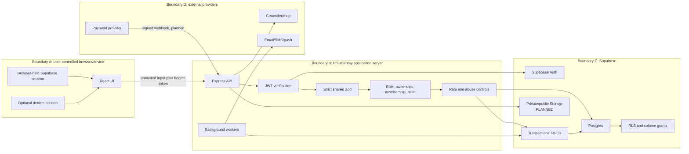

# 6. Security design

This document is the target security architecture and an honest inventory of
current controls. It does not treat hidden buttons as security and does not
describe planned controls as active.

## 6.1 Control status

| Status | Meaning |
| --- | --- |
| **Implemented** | Present in code/migrations and covered by an appropriate test or direct evidence. |
| **Partial** | Core control exists, but scope, deployment, persistence, or test coverage is incomplete. |
| **Planned** | Required before production for the associated feature. |
| **Deferred** | Deliberately outside the next release boundary. |

## 6.2 Security principles

1. Start every account with minimum authority.
2. The browser is untrusted; React guards are usability only.
3. Authenticate every protected request with Supabase `getUser` verification.
4. Validate a strict shared schema before database access.
5. Authorize role, participant, ownership, employment, verification, and state
   in Express before using the service role.
6. Repeat critical invariants in RLS, constraints, triggers, or locked RPCs.
7. Keep the service-role key and provider secrets server-side only.
8. Prefer append-only events for sensitive decisions and lifecycle changes.
9. Collect and expose the minimum personal/location data needed.
10. Design retries, races, and compromised clients as normal threat cases.

## 6.3 Protected assets

| Asset | Why it matters |
| --- | --- |
| Auth identities, sessions, reset links | Account takeover grants all user authority. |
| Effective role and verification status | Unauthorized changes create privilege escalation. |
| Verification evidence | Government/business documents are highly sensitive. |
| User contact and location data | Private PII; job seekers require coarse public location only. |
| Shop ownership, location, and publication | Fake or hijacked shops harm customers and reputation. |
| Appointment and check-in evidence | Controls service completion, ratings, disputes, and later money. |
| Messages and staff notes | Private participant/shop communications. |
| Ratings and moderation history | Public trust signal vulnerable to fraud and retaliation. |
| Service-role key and external provider keys | May bypass RLS or spend external resources. |
| Appointment/verification/security events | Evidence for disputes, debugging, and incident response. |
| Future payment records | Financial integrity and legal obligations. |

## 6.4 Trust boundaries



The current browser persists a bearer session, so XSS has high impact. React
text rendering, CSP, dependency hygiene, and removal of unsafe HTML are
important. Before high-value payments, evaluate an HttpOnly BFF/session design
or explicitly accept and mitigate the browser-token risk.

## 6.5 Authentication and session controls

### Implemented

- Supabase Auth stores credentials.
- Express verifies bearer tokens through Supabase rather than trusting decoded
  claims alone.
- Protected API routers run authentication before operational routes.
- Signout and refresh paths exist.
- Bundled demo accounts and committed reusable credentials were removed.

### Required next

- Email verification policy and protected email-change confirmation.
- CAPTCHA/risk controls on signup, signin recovery, and professional
  verification submission.
- MFA for admins and strongly recommended MFA for owners.
- Session/device list, revoke-one, revoke-all, recent-auth checks for sensitive
  changes, and suspicious-login alerts.
- Documented access/refresh lifetime and rotation behavior.
- No account-enumerating errors or timing differences.

## 6.6 Authorization chain

For every protected operation:

```text
Bearer token
  -> Supabase getUser
  -> public.users profile
  -> operational-access check
  -> required effective role
  -> verification/suspension state
  -> resource participant / shop owner / active employment
  -> current domain state and expected version
  -> allowlisted mutation
  -> RLS/constraint/RPC repeats critical checks
```

The service role bypasses RLS. A route that queries by a user-supplied ID before
authorization can become cross-shop IDOR even when RLS policies are strong.
Prefer resolving and authorizing the resource first, then calling a narrow RPC.

### Current gap

The restrictive pending-owner policy is implemented, but pending/suspended
barber handling is incomplete. Active-membership helpers also need to account
for later suspension, not only verification at employment insertion.

## 6.7 RLS and tenant isolation

### Implemented

- RLS enabled on every public application table.
- `anon` has no direct table access.
- Customers are limited to own appointments, ratings, preferences, favorites,
  and participant messages.
- Barbers are limited to own/assigned/employment-scoped records.
- Owners are limited to owned-shop operational records.
- Join codes and staff notes are not public catalogue data.
- Column grants restrict ordinary profile mutation.

### Required testing pattern

For each table/endpoint create actors in Shop A and Shop B:

1. Own actor succeeds for allowed action.
2. Same role in other shop cannot read.
3. Same role in other shop cannot mutate.
4. Different role cannot spoof owner/barber/customer ID.
5. Pending, rejected, and suspended actors fail.
6. Direct authenticated Supabase query fails where Express would fail.
7. Service-role path succeeds only after Express/RPC authorization.

## 6.8 Professional verification security — PLANNED

### Role promotion

- `requested_role` is applicant intent, never authority.
- Normal profile updates cannot write effective role or verification status.
- Approval uses a trusted atomic RPC that locks submission/profile, verifies
  admin, updates role/status, creates the professional extension, and inserts an
  event.
- Rejection, needs-information, suspension, and restoration require reason.
- Applicant cannot review their own request.

### Evidence upload

- Private bucket with path ownership and no public listing.
- Pre-signed upload or server upload with small size limit.
- Allowlisted types plus magic-byte verification; extension is not trusted.
- Virus/malware scan and image metadata stripping where applicable.
- Store hash, detected MIME, size, uploader, scan state, and timestamp.
- Reviewer reads through short-lived, purpose-bound signed URL.
- Log reviewer access.
- Delete according to approved retention; retain only decision/event facts when
  legally and operationally appropriate.

### Admin console

- MFA and least-privilege reviewer permission.
- Queue does not preload documents.
- No permanent document links in logs, analytics, or notifications.
- Bulk approval is prohibited for high-risk evidence.
- Every decision and exceptional support access is auditable.

## 6.9 Shop publication and location security — PLANNED

Threats include fake shops, deceptive pins, owner hijacking, malicious photos,
and publication of incomplete/suspended businesses.

Controls:

- Verified owner required to create/publish.
- Draft is private to owner/admin.
- Server normalizes address/place reference and validates coordinate bounds.
- Publication is a server-side lifecycle state checked in catalogue query/RLS.
- Ownership/location material changes return to review where policy requires.
- Image upload follows type/scan/size/metadata rules and moderation state.
- Public contact is a business contact, never leaked owner private contact.
- Duplicate/risk signals and user reports feed admin review.

## 6.10 Booking and fulfillment security

### Implemented strengths

- Database time-range exclusion prevents same-barber active overlap.
- Locked, versioned appointment RPCs prevent stale write clobbering.
- Explicit actor-scoped commands replace arbitrary status changes.
- Service details and price are snapshotted.
- Check-in code is six digits, bcrypt-hashed, and expires.
- Only assigned active barber starts and finishes.
- Customer controls confirmation/dispute.
- Immutable events record lifecycle evidence.
- Expiry/finalization functions are retry-safe state transitions.

### Required next

- Per-user/IP/appointment check-in attempt limits.
- Idempotency key for booking creation.
- Customer-overlap protection.
- Database/server validation against shop hours and closures.
- Store exact/preferred/any-barber consent and enforce reassignment policy.
- Symmetric shop/barber no-show dispute path.
- Attention queue instead of automatic guesses for missing evidence.
- Scheduled worker health/lease/metrics and alert when due transitions stop.

## 6.11 Messaging and hiring abuse controls

### Current

- Conversation shape and sender membership are validated.
- Message length is bounded.
- React renders text rather than user HTML.
- API has a general IP rate limiter.

### Planned

- Distributed limits by IP, authenticated user, conversation, shop, and action.
- Tighter limits for applications, invitations, join-code attempts, booking
  creation, check-in codes, and message sending.
- Block, mute, report, moderation, and notification-throttling workflows.
- Hiring contact only after application/invitation context.
- Join-code expiry, rotation, attempt limits, pending owner confirmation, and
  use event.
- Attachment scan/storage policy before any message attachment feature.

In-memory rate limiting is insufficient for horizontally scaled production;
use a shared store and configure trusted proxy hops precisely.

## 6.12 Ratings and analytics integrity

- Database verifies the rating belongs to the appointment customer.
- Appointment must be completed.
- Actual appointment barber/shop IDs determine the targets.
- Unique appointment constraint prevents duplicate review.
- Aggregate refresh happens in database logic.
- Disputed/unresolved visits cannot unlock review.
- Moderation hides policy-violating content through an event; it does not let an
  owner erase criticism.
- Analytics definitions count finalized states and use snapshotted values.
- Financial reporting remains unavailable until payment evidence exists.

## 6.13 Input, output, and browser security

### Implemented

- Strict shared Zod objects reject unexpected fields on key request bodies.
- Supabase/RPC calls are parameterized.
- JSON body limit is 64 KB.
- Helmet and exact configured CORS origins are used.
- React text nodes and `textContent` are preferred over raw HTML.
- Internal redirect paths are sanitized.

### Rules

- Never add `dangerouslySetInnerHTML` for messages, notes, reviews, or shop
  content.
- Encode route segments and use `URLSearchParams` for queries.
- Use explicit database column allowlists; do not spread arbitrary body objects
  into privileged tables without a strict schema.
- CSP must be production-deployed and tested, not only a Vite preview setting.
- If cookie sessions are introduced, add SameSite, Origin checking, and CSRF
  tokens; bearer headers reduce ambient CSRF but do not solve XSS.
- Never put secrets in `VITE_*`, source maps, client logs, or analytics payloads.

## 6.14 Secret management

| Secret | Location | Rule |
| --- | --- | --- |
| Supabase service-role/secret key | Express environment/secret manager | Never browser-visible; rotate after suspected exposure. |
| Supabase publishable key | Browser environment | Public identifier, still scope with RLS. |
| Database URL/password | Server/CI secret manager | No committed values; restrict network and role. |
| Notification/geocoder/payment keys | Server/worker secret manager | Separate by environment and least privilege. |
| Local development secrets | Ignored `.env` | `.env.example` documents names only. |

CI should scan source, history, images, logs, and built frontend assets for
secrets. Redact tokens, codes, document paths, and message bodies from routine
logs.

## 6.15 Threat and control matrix

| Threat | Status | Required control | Verification test |
| --- | --- | --- | --- |
| Service key committed or sent to browser | Implemented foundation | Server env only, no `VITE_`, scan/rotation runbook. | Inspect built assets and repository scan. |
| Credential stuffing/account takeover | Partial | Auth/IP/email limits, CAPTCHA, MFA, device/session revoke. | Repeated failure returns 429; MFA bypass tests. |
| Self-granted barber/owner/admin | Partial | Base role, atomic admin promotion, restrictive Express/RLS, immutable event. | Crafted onboarding/profile/direct DB requests fail. |
| Pending/suspended professional bypass | Partial | Unified operational-access predicate for owner and barber. | Direct route/API/RLS matrix for each status. |
| Cross-shop IDOR | Implemented foundation | Owned shop/active employment checks plus RLS. | Shop A actor probes every Shop B resource/action. |
| Fake or premature shop publication | Planned | Draft lifecycle, verified owner, server publication query. | Draft/suspended shop absent from API and direct RLS. |
| Verification evidence exposure | Planned | Private bucket, signed URLs, audit, scan, retention. | Cross-user/object-listing/expired-URL tests. |
| Double booking/race | Implemented | Exclusion constraint, locks, version, idempotency. | Concurrent same/overlap requests: exactly one wins. |
| Replayed stale command | Implemented/Partial | Expected version and action idempotency keys. | Repeat/stale mutation returns conflict without duplicate event. |
| Forged completion/rating | Implemented foundation | Check-in/start/finish/customer chain, completed-only unique review. | Wrong actor/state/appointment rating tests fail. |
| Join-code abuse | Partial | Pending owner approval, expiry, hash/rotation, attempt limit, audit. | Leaked/expired/brute-forced code cannot activate. |
| Message/application spam | Partial | Distributed per-user/IP/context limits, block/report. | Action-specific 429 and cross-context contact denial. |
| XSS steals bearer token | Partial | React text, CSP, dependency audit, no unsafe HTML; evaluate BFF. | Stored/reflected payload suite and CSP report review. |
| Data loss/corruption | Planned operations | Encrypted backups, PITR, tested restore, migration rollback. | Scheduled restore drill with measured RPO/RTO. |
| Worker silently stops | Partial | Lease, heartbeat, lag metric, alert, idempotent catch-up. | Stop worker; alert and restart catch up once. |
| Payment spoof/replay | Deferred | Signed webhook, provider-event uniqueness, reconciliation. | Replay and forged signature tests before commerce launch. |

## 6.16 Logging, audit, and monitoring

Use structured logs with request/correlation ID, route, status, latency, actor ID
when appropriate, and safe error code. Avoid tokens, passwords, check-in codes,
document URLs, message bodies, and full PII.

Append-only domain/security events should cover:

- Verification submissions, reviews, role changes, suspension/restoration.
- Shop publication, ownership/location change, suspension/closure.
- Employment request, activation, termination, code rotation/use.
- Appointment lifecycle and dispute resolution.
- Exceptional admin data access and moderation.
- Session revoke, MFA change, credential/secret rotation incidents.

Monitor authentication failures, 403/404 probing, 409 booking conflicts,
rate-limit hits, worker lag, outbox backlog, database/RPC errors, upload scan
failures, admin actions, and cross-shop denial anomalies.

## 6.17 Privacy and retention

- Obtain purpose-specific location consent; do not continuously store customer
  GPS merely because discovery uses it.
- Public barber job location is coarse; exact home data remains private.
- Distinguish owner private contact from public business contact.
- Provide access/export/correction/deletion workflows.
- Set documented retention for verification evidence, messages, appointments,
  events, logs, device tokens, backups, and future payments.
- Pseudonymize retained transactional records when an account is deleted and
  identity is no longer required.
- Record who accessed verification evidence and why.

Legal/privacy policy choices require qualified review before production; this
document defines the technical controls needed to enforce the chosen policy.

## 6.18 Backup, recovery, and incident response

Before production:

1. Enable encrypted backups/PITR appropriate to the deployment tier.
2. Define and test recovery point and recovery time objectives.
3. Restore into an isolated environment and verify Auth/profile/references/RLS.
4. Document migration rollback or compensating migrations.
5. Maintain incident severity, containment, evidence preservation,
   notification, credential rotation, and postmortem procedures.
6. Separate development, staging, and production projects/keys/data.
7. Use protected deployments and least-privilege administrator access.

## 6.19 Security release gates

A production candidate cannot pass until:

- No committed or built-client secrets are found.
- Professional verification and admin promotion cannot be bypassed.
- Draft/suspended shops do not appear in discovery.
- Cross-shop/customer/barber RLS and Express matrices pass.
- Concurrent booking, stale version, replay, and idempotency tests pass.
- Check-in/completion/rating actor and state tests pass.
- Upload/private-document tests pass if uploads ship.
- Action-specific rate limits return consistent 429 responses.
- Dependency, SAST, CSP, XSS, accessibility, and load checks pass.
- Worker lag monitoring and catch-up behavior are proven.
- Backup restore drill succeeds.
- Privacy/retention/export/deletion behavior is documented and tested.
