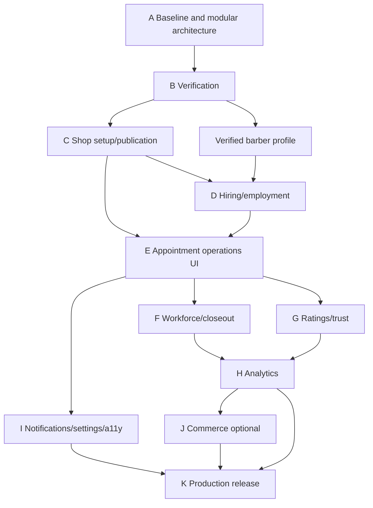

# 7. Philabantay digital roadmap

> **Historical roadmap:** The authoritative V1 delivery sequence is now the
> [five-phase implementation plan](../plans/README.md). This A–K roadmap is
> retained to explain project history and earlier work-package reasoning.

This roadmap follows the repository from its first commit to a production-ready
platform. It distinguishes committed history, current uncommitted working-tree
work, and future plans. Dates in the historical section come from Git; future
phases use dependency gates rather than invented deadlines.

## 7.1 Roadmap at a glance

```mermaid
flowchart LR
    H0["2026-07-09<br/>Mock-backed MVP foundation<br/>COMMITTED"]
    H1["2026-07-11<br/>Landing redesign and lazy routing<br/>COMMITTED"]
    H2["2026-07-13<br/>Security and role/UI expansion<br/>COMMITTED"]
    H3["2026-07-16<br/>Frontend cleanup, audits, role dashboards<br/>COMMITTED"]
    H4["2026-07-17<br/>Supabase, Express, ApiBackend, RLS<br/>WORKING TREE"]
    H5["2026-07-18<br/>Canonical appointment lifecycle<br/>WORKING TREE"]
    Now["Current<br/>Documentation and baseline reconciliation"]

    P1["A. Checkpoint and performance-safe architecture"]
    P2["B. Professional verification"]
    P3["C. Shop setup and publication"]
    P4["D. Hiring and employment marketplace"]
    P5["E. Cross-role appointment operations UI"]
    P6["F. Workforce truth and daily closeout"]
    P7["G. Ratings, trust, and moderation"]
    P8["H. Owner analytics"]
    P9["I. Notifications, settings, accessibility"]
    P10["J. Optional commerce"]
    P11["K. Production release and continuous operations"]

    H0 --> H1 --> H2 --> H3 --> H4 --> H5 --> Now
    Now --> P1 --> P2 --> P3 --> P4 --> P5 --> P6 --> P7 --> P8 --> P9 --> P10 --> P11
```



Commerce may be skipped for the first production release. Appointment truth,
verification, tenant isolation, shop publication, and operational reliability
cannot be skipped.

## 7.2 Historical evolution

### 2026-07-09 — Phase 1 mock-backed MVP

Repository evidence: commit `dbdc547`.

- React/Vite/TypeScript monorepo.
- Shared `DataBackend` seam.
- Browser mock persistence.
- Customer discovery, booking, chat, favorites, and barber availability.
- Customer, barber, and owner concepts established.
- Doodle/notebook visual identity established.

Lesson: the stable service interface made later backend replacement possible,
but browser storage was never a production authorization boundary.

### 2026-07-11 — landing and routing pass

Repository evidence: commits `cc0eda5`, `1d5538c`, `546a128`.

- Landing/auth presentation expanded.
- Animated storefront and city assets developed.
- Lazy route loading and error-boundary work.
- Early performance and visual-direction decisions.

Lesson: strong visual identity is valuable, but long-running decorative
animation must not compete with booking/task performance.

### 2026-07-13 — security and role expansion

Repository evidence: commit `ce6afe3`.

- Security hardening and documentation.
- Password handling improvements for mock mode.
- Role selection, navigation, maps, settings, and role dashboards expanded.
- Owner/barber/customer information architecture became clearer.

Lesson: React role guards improve experience but cannot authorize production
data.

### 2026-07-16 — frontend cleanup, dashboards, and audits

Repository evidence: commit `24d13d8`.

- Customer, barber, and owner dashboard work.
- Calendars, avatars, menu/navigation, landing assets, and compactness passes.
- Architecture, code-pattern, feature, and code-audit documents expanded.
- Performance bottlenecks and product loopholes recorded.

Lesson: large role dashboards now need separation by feature and route bundle.

### 2026-07-17 — real backend foundation (current working tree)

This work is present locally but is not represented by a later commit in the
current Git history.

- Credential-free seeds and removal of bundled accounts.
- Versioned Supabase Postgres schema.
- RLS and domain triggers/functions.
- Express REST API with JWT verification, Zod, authorization, error shape,
  Helmet, CORS, and rate limiting.
- `ApiBackend` implementing the shared interface.
- Local RLS/API isolation tests for customer, barber, and owner.
- Pending-owner operational lock.

Risk: a large dirty working tree makes accidental overwrite and unclear review
more likely. The next action is a tested checkpoint, not another broad rewrite.

### 2026-07-18 — appointment truth (current working tree)

- Canonical requested-to-completed/disputed lifecycle.
- Immutable appointment events.
- Hashed, expiring check-in code.
- Owner fallback check-in reason.
- Barber start/finish.
- Customer confirmation/dispute.
- Request expiry and completion timeout functions/worker.
- Optimistic versioning and stale-write conflict.
- Same-barber overlap exclusion.
- Owner reassignment and service snapshots.
- Owner analytics compatibility using completed service value.

Lesson: backend appointment truth is ahead of some UI and older documentation.
The next appointment work is primarily cross-role UI, policy, and scenario
testing—not reinventing the state machine.

### Current — documentation consolidation

- Ordered flowchart, UML, DFD, database, workflow, security, and roadmap suite.
- Current-versus-planned labels.
- Existing long-form documents consolidated under `docs/`.
- Cross-agent coordination contract.

## 7.3 Delivery principles for all future phases

1. Work inside-out: shared contract, migration, API, adapter, then UI.
2. Preserve one authoritative source for each fact.
3. No hardcoded accounts, credentials, analytics, or fake production activity.
4. Every role and shop boundary gets both Express and RLS tests.
5. Every mutation covers busy, duplicate, stale, validation, and authorization
   behavior.
6. Every planned feature stays labeled until an end-to-end test proves it.
7. Performance and accessibility are exit gates, not cleanup someday.
8. Migrations are forward-only versioned artifacts with verification and a
   rollback/compensation plan.
9. Documentation changes with behavior.
10. Financial labels require payment evidence.

## 7.4 Phase A — trustworthy baseline and modular frontend

**Status:** next.  
**Depends on:** current working tree.  
**Goal:** preserve working behavior while making subsequent features safer to
add.

### Deliverables

- Reconcile stale claims in older architecture, security, schema, feature, and
  roadmap documents.
- Run shared/API/web typecheck, build, unit tests, local Supabase integration,
  three-role browser smoke test, and `git diff --check`.
- Create a reviewable checkpoint of the current working tree.
- Propose and execute a behavior-preserving frontend structure:

```text
apps/web/src/
├─ dashboards/{customer,barber,owner}/
├─ features/{avatar,chat,settings,customer-bookings,barber-schedule,
│            owner-reservations,owner-staff,owner-stats,hiring,shop-setup}/
├─ pages/       route orchestration
└─ components/  shared presentation
```

- Lazy-load each role dashboard so users do not download other role bundles.
- Measure initial/role bundle sizes and expensive render counts before/after.
- Parallelize independent reads; add cursor pagination to reservations/messages
  and other unbounded lists.
- Add skeleton, empty, error, retry, and reduced-motion states.

### Security gate

No authorization/business rule changes during the structural move. No page may
import MockBackend or call Supabase directly.

### Exit gate

Same end-to-end behavior and test results, smaller isolated role bundles,
documented measurements, and a clean reviewable checkpoint.

### Rollback

Move-only commits are isolated from behavior/performance changes so a component
move can be reverted without reverting backend features.

## 7.5 Phase B — professional verification

**Status:** planned, highest security priority.  
**Depends on:** Phase A baseline.

### Database/backend

- Verification submissions, documents, and append-only events.
- Private evidence storage policies and scan pipeline.
- Atomic admin approval/promotion RPC.
- Unified pending/rejected/suspended operational access for owner and barber.
- Admin reviewer permission and audited document access.

### Frontend

- Role-specific barber/owner verification forms.
- Pending, needs-information, rejected, approved, and suspended states.
- Minimal MFA-protected admin review screen.
- Verification-only route lock with sign out and allowed resubmission.

### Tests

- Crafted role/profile writes fail.
- Pending/rejected/suspended direct API and RLS calls fail.
- Cross-user documents fail.
- Applicant cannot self-approve.
- Approval creates exactly one role/profile/event under retry/concurrency.

### Exit gate

A barber and owner can be approved without manual SQL; all bypass tests fail;
evidence is never public or permanently linked.

## 7.6 Phase C — Shop Setup and publication

**Status:** planned; basic Express shop/service writes exist but shared/UI path
is incomplete.  
**Depends on:** verified owner from Phase B.

### Deliverables

- Shop lifecycle: draft, pending review if required, published, suspended,
  archived.
- Extend shared Shop/Service contracts with owner create/update operations.
- Owner wizard: identity, map pin, timezone/hours/closures, services/prices,
  specialties, photos, policies, staffing, review/publish.
- Private staging and safe public derivatives for images.
- Published-only discovery at API and RLS/query boundary.
- Material location/ownership edit review policy.

### Tests

- Unverified owner cannot create/publish.
- Draft/suspended shop is absent from discovery and direct catalogue queries.
- Cross-owner edits fail.
- Invalid hours, coordinates, media, or service/shop reference fail.
- Historical appointment price remains unchanged after catalog edit.

### Exit gate

A verified owner can create, resume, publish, and later edit a real shop; an
incomplete or ineligible shop cannot become discoverable.

## 7.7 Phase D — hiring and employment marketplace

**Status:** partial foundation.  
**Depends on:** published shops and verified barbers.

### Deliverables

- One hiring source on shop: on/off, optional remaining openings, note, role,
  employment type, requirements, updated time.
- Migrate and retire or formally preserve `hiring_listings` without dual writes.
- Job-seeker barber profile with opt-in/coarse location/portfolio/specialties.
- Barber application and owner invitation paths.
- Hiring-scoped conversation.
- Join code becomes expiring/rate-limited pending owner confirmation.
- Unified employment request and atomic activation/opening decrement/auto-off.
- Distinct hiring map badge/pin and full/closed refresh behavior.

### Tests

- Non-hiring/draft/suspended shops do not appear.
- Cross-shop application resolution fails.
- Two concurrent accepts for final opening cannot overfill.
- Active barber cannot join another shop.
- Leaked/expired code cannot activate employment.
- Opening count and active roster never diverge after retry.

### Exit gate

Applications, invitations, and join requests all converge on one verified,
owner-approved, auditable employment activation path.

## 7.8 Phase E — cross-role appointment operations UI

**Status:** backend largely current; UI partial.  
**Depends on:** stable shop and staff context.

### Deliverables

- Persist exact/preferred/any-barber choice and support unassigned requests.
- Customer timeline: request, expiry, confirmation, check-in, confirmation,
  cancellation, dispute, rating.
- Owner action queue: accept/decline/assign/reassign/conflict and reasons.
- Barber work console: issue code, start, finish, no-show eligibility.
- Clear stale-version reload and duplicate-submit behavior.
- Symmetric shop/barber no-show report and attention task.
- Accessible status text and notification seam.

### Scenario gate

Run customer request → owner accept/assign → customer check-in → barber
start/finish → customer confirm/dispute → completion/rating using only UI and
normal API calls, with an immutable timeline and no manual SQL.

## 7.9 Phase F — workforce truth and daily closeout

**Status:** planned/partial staff foundation.  
**Depends on:** employment and operations UI.

### Deliverables

- Owner-assigned shift truth and structured barber change requests.
- Clock-in/out, late, absence, correction/approval, and attendance events.
- Employment ending flow that resolves future bookings first.
- Appointment attention items.
- Unique idempotent shop/day closeout runs 30 minutes after local close.
- Closeout summary and worker health/lag monitoring.

### Exit gate

Shift/employment changes cannot strand a future appointment; closeout never
deletes history or guesses completion/misconduct; retries produce one result.

## 7.10 Phase G — ratings, trust, and moderation

**Status:** completed-only rating core exists; discovery/moderation partial.

### Deliverables

- Public verified-visit review list and 1–5/newest/highest/lowest filters.
- Rating edit window and one-review policy.
- Owner/barber response, abuse report, moderation state/event, appeals.
- Sample-size context and separate barber/shop aggregate explanation.
- Reputation abuse/spam limits.

### Exit gate

No foreign, duplicate, uncompleted, or unresolved visit can produce a rating;
moderation is auditable and owners cannot erase valid criticism.

## 7.11 Phase H — owner operations and analytics

**Status:** partial real dashboards.

### Deliverables

- Operations-first home: pending requests, conflicts, today’s service states,
  staff, applications, attention items.
- Analytics section: funnel, demand/capacity, service mix/value, barber workload,
  punctuality, retention, ratings, cancellation/no-show reasons.
- Stable date range/timezone definitions and cursor/batch query strategy.
- Table equivalents and explanations for every chart.
- Data-quality warnings where facts are incomplete.

### Exit gate

Each metric has a documented query/definition and is reproducible from finalized
records. Financial UI says completed service value until payments exist.

## 7.12 Phase I — notifications, settings, accessibility, and polish

**Status:** preferences/settings UI partial; delivery absent.

### Deliverables

- Notification outbox, provider deliveries, retry/idempotency/health.
- In-app notifications and optional push/email/SMS according to preference and
  transactional policy.
- Account security: MFA, devices/sessions, privacy/export/deletion.
- Role-specific settings and clear separation of account vs shop settings.
- Readable font, language, reduced motion, contrast, keyboard, screen-reader,
  focus, chart-table, and error-announcement support.
- Pagination, caching, role bundle measurements, map/chart/animation profiling,
  mobile polish.
- Remove canned chat quick replies.

### Exit gate

Critical state remains usable if external delivery fails; WCAG-oriented manual
and automated checks pass; performance budgets pass on representative devices.

## 7.13 Phase J — optional commerce

**Status:** deferred.  
**Depends on:** stable fulfillment, disputes, trust, closeout, security, and
legal/product payment decisions.

Potential scope:

- Deposits, cash/provider payments, tips, refunds, receipts, provider webhooks.
- Idempotent payment events and reconciliation.
- Cancellation/no-show financial policy snapshots.
- Owner payout/commission only after a separate accounting design.

Security gate: signed webhooks, replay protection, exact amount/currency,
provider-event uniqueness, least-privilege secrets, refund authorization,
reconciliation, incident/chargeback handling.

Appointment status never becomes `paid`; fulfillment and settlement remain
separate domains.

## 7.14 Phase K — production release and continuous operations

**Status:** planned final release gate, followed by ongoing work.

### Release verification

- Full unit/integration/RLS/authorization/E2E scenario matrix.
- Concurrent booking/hiring, stale version, idempotency, rate/load tests.
- Secret scan, dependency/SAST, CSP/XSS, upload tests.
- Accessibility, browser, mobile, reduced-motion and performance budgets.
- Database migration rehearsal, backup/PITR restore drill, rollback plan.
- Worker/outbox/queue observability and alerting.
- Privacy terms, retention, export/deletion, support, and incident runbooks.
- Staging soak, feature flags, gradual rollout, monitored rollback threshold.

### Continuous operations

- Monitor errors, authorization denials, worker lag, queue backlog, booking
  conflicts, abuse, slow queries, web vitals, and delivery failures.
- Patch dependencies and rotate secrets.
- Review access and admin actions.
- Run restore/security/accessibility drills.
- Use support and analytics to prioritize future releases without silently
  changing metric definitions or policies.

## 7.15 Dependency map



Verification and shop publication are foundational because hiring, discovery,
and owner operations should not build new behavior on untrusted identities or
automatically public shop rows.

## 7.16 Suggested agent/work ownership

| Lane | Primary ownership | Must coordinate on |
| --- | --- | --- |
| Backend/database (Codex) | Shared types/DTOs/schemas, migrations, RLS/RPC, Express routes/authz, ApiBackend, workers, integration tests. | API contract, state names, error codes, pagination. |
| Frontend/design (Claude) | Route composition, feature modules, owner/barber/customer UI, responsive CSS, skeletons, accessibility, UI tests. | Required backend method and current-vs-planned capability. |
| Joint QA | Browser flows, role matrix, screenshots, performance, status copy, documentation. | Gate evidence and discrepancy resolution. |

Neither lane may “solve” a missing dependency by calling Supabase directly from
React, falling back to mock data, hardcoding accounts, or duplicating business
rules.

## 7.17 Overall definition of done

Philabantay reaches the end of this roadmap when:

1. Users cannot self-grant professional authority.
2. Only eligible published shops are discoverable.
3. Hiring and employment are verified, owner-approved, concurrency-safe, and
   auditable.
4. A complete appointment can be operated by all three roles without manual
   database changes.
5. Physical completion is supported by recorded evidence and disputes.
6. Cancellations/no-shows/closeout retain history and never guess silently.
7. Ratings are verified-visit only.
8. Analytics have definitions and do not call estimates revenue.
9. Cross-user/shop isolation passes at Express and RLS layers.
10. Accessibility, performance, recovery, observability, privacy, and security
    release gates pass.
11. Documentation and tests match the deployed behavior.
