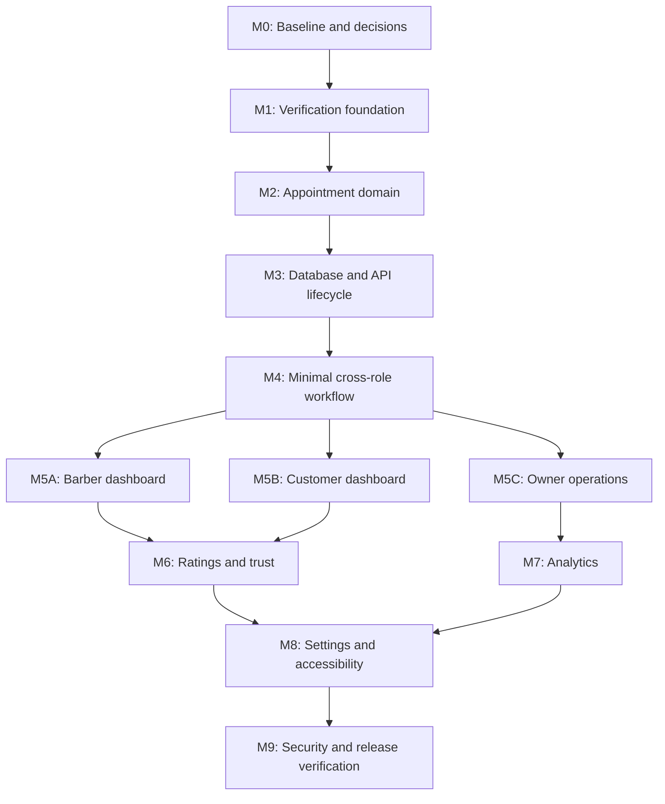

# Philabantay Implementation Roadmap

> **Historical work-package plan:** Use the repository-level
> [five-phase V1 plan](../plans/README.md) for new implementation and agent
> handoffs. This document remains for context and comparison.

Status: historical work-package plan; see `07-DIGITAL-ROADMAP.md` for the
current reconciled roadmap and status

Last updated: 2026-07-18

This roadmap converts the findings in
[`PRODUCT-LOGIC-AUDIT-AND-ROADMAP.md`](PRODUCT-LOGIC-AUDIT-AND-ROADMAP.md)
into ordered implementation milestones. Read `ARCHITECTURE.md`,
`CODE-PATTERNS.md`, the product-logic audit, and `HANDSON.md` before starting a
work package.

## 1. Product outcome

Philabantay should provide a trustworthy end-to-end flow for four actors:

- Customers discover shops, create and manage bookings, check in, confirm a
  completed service, and submit a verified rating.
- Barbers pass verification, join a shop, manage assigned work and schedules,
  and record the actual service lifecycle.
- Shop owners pass verification, operate their shop, manage reservations and
  staff, and make decisions using correctly defined analytics.
- Admins review professional-account verification, handle escalations, and
  inspect auditable decisions without participating in routine shop operations.

The first release is booking-focused. Payment processing, advanced queue
prediction, loyalty expansion, commissions, and multi-branch ownership remain
outside the initial boundary unless the product owner explicitly brings them
into scope.

## 2. Delivery principles

1. Define product rules before designing controls for them.
2. Implement each feature as a vertical slice: shared contract, database, API,
   UI, and tests.
3. React uses `DataBackend`; it does not call Supabase directly.
4. Authorization is enforced by Express and RLS, not only by route guards.
5. Do not introduce fake controls or placeholder operational data.
6. Keep appointment fulfillment, payments, attendance, and notifications as
   separate state domains.
7. Every sensitive decision records actor, reason, timestamp, and history.
8. Keep role navigation in the hamburger menu.
9. Preserve the notebook/doodle visual system while improving information
   architecture, responsiveness, and accessibility.
10. Stop at each milestone gate for review before beginning dependent work.

## 3. Dependency map



Dashboard work may be divided by role after Milestone 4 passes. Work before
that point is intentionally sequential because the roles depend on the same
verification and appointment contracts.

## 4. Status legend

- `[ ]` Not started
- `[~]` In progress
- `[x]` Completed and accepted
- `[!]` Blocked or requires a product decision

An item is not complete merely because its UI renders. The milestone gate must
also pass.

## 5. Milestone 0: baseline and product decisions

Goal: establish a reliable starting point and settle the rules that affect the
schema.

### Work package 0A: repository baseline

- [ ] Record the current branch, uncommitted files, and ownership of existing
  changes.
- [ ] Run workspace typecheck, tests, lint, and production build.
- [ ] Record existing failures without fixing unrelated issues.
- [ ] Confirm local Supabase, Express, and the web app can start.
- [ ] Confirm current three-role authentication tests still behave as expected.

### Work package 0B: product decisions

- [ ] Confirm the initial release is booking-only and rename unverified
  `Revenue` metrics to `Completed service value`.
- [ ] Confirm PIN/QR customer check-in with an audited owner fallback.
- [ ] Confirm the pending-reservation expiration duration.
- [ ] Confirm customer late/no-show grace duration.
- [ ] Confirm customer completion confirmation and automatic-finalization
  duration.
- [ ] Confirm whether verification evidence uploads are required in the first
  release.
- [ ] Confirm who can approve barber identity: platform admin only, or a
  documented trusted-owner sponsorship policy.
- [ ] Confirm the rating edit window.

### Milestone 0 gate

- Baseline results are documented.
- No unexplained test regression exists.
- Every schema-affecting product decision above has an accepted default.

## 6. Milestone 1: verification foundation

Goal: provide a complete, auditable path from account signup to granted
professional role.

### Work package 1A: shared verification contract

- [ ] Add verification request, document metadata, event, and admin-decision
  types.
- [ ] Define states: draft, submitted, under-review, needs-information,
  approved, rejected, and suspended.
- [ ] Define transition helpers and actor permissions in the shared domain.
- [ ] Add strict Zod schemas for submission, resubmission, request-information,
  approval, rejection, and suspension.
- [ ] Add contract tests for allowed and forbidden transitions.

Primary ownership:

- `packages/shared/src/types.ts`
- `packages/shared/src/dto.ts`
- `packages/shared/src/schemas.ts`
- New shared verification rule/test files

### Work package 1B: Supabase verification schema

- [ ] Add `verification_requests`.
- [ ] Add `verification_documents` if evidence uploads are in scope.
- [ ] Add immutable `verification_events`.
- [ ] Add private owner shop-draft linkage.
- [ ] Add indexes, constraints, RLS, and storage policies.
- [ ] Add atomic server-only approval/suspension functions.
- [ ] Ensure owner approval grants role and attaches the shop draft.
- [ ] Ensure barber approval grants role and creates the barber profile.

### Work package 1C: Express verification API

- [ ] Applicant create/read/update/submit/resubmit endpoints.
- [ ] Admin list/detail/request-info/approve/reject/suspend endpoints.
- [ ] Shared Zod validation on every body.
- [ ] Admin and applicant authorization.
- [ ] Consistent error codes and safe messages.
- [ ] Integration tests for customer, pending applicant, professional, owner,
  and admin boundaries.

### Work package 1D: verification UI

- [ ] Barber application form and review-before-submit screen.
- [ ] Owner application plus private shop-draft form.
- [ ] Pending/needs-information/rejected/suspended status screens.
- [ ] Preserve the owner full-account lock outside the verification portal.
- [ ] Minimal admin verification queue and decision screen.
- [ ] Responsive and keyboard/screen-reader verification.

### Milestone 1 gate

- A new barber can submit, be approved, receive the barber role, and then apply
  to a shop without manual database editing.
- A new owner can submit, be approved, receive the owner role, and own a private
  or publishable shop draft without manual database editing.
- Rejected and needs-information applicants can follow a defined recovery path.
- Direct RLS and Express attempts cannot bypass review.

## 7. Milestone 2: appointment domain contract

Goal: agree on one state machine before changing the appointment schema or UI.

### Work package 2A: fulfillment states

- [ ] Define requested, confirmed, checked-in, in-progress,
  awaiting-confirmation, completed, declined, expired, cancelled,
  customer-no-show, and disputed states.
- [ ] Define terminal and active states.
- [ ] Define valid transitions by actor.
- [ ] Define cancellation, check-in, start, no-show, and completion time windows.
- [ ] Define how material rescheduling returns to approval.
- [ ] Define barber reassignment and conflict rules.
- [ ] Define automatic system transitions.

### Work package 2B: shared command contract

- [ ] Replace the broad public status mutation concept with explicit commands.
- [ ] Add request DTOs for accept, decline, check-in, start, finish,
  confirm-completion, dispute, cancel, no-show, and reassign.
- [ ] Require reasons for cancellation, no-show, override, and dispute actions.
- [ ] Define appointment event and timeline response shapes.
- [ ] Add pure transition/time-window tests.

### Milestone 2 gate

- The state transition table is approved by the product owner.
- Shared tests prove every allowed and forbidden role transition.
- UI agents can use the contract without inventing additional states.

## 8. Milestone 3: appointment database and API

Goal: make the approved lifecycle transactional, auditable, and secure.

### Work package 3A: appointment persistence

- [ ] Migrate the appointment status model.
- [ ] Add immutable `appointment_events`.
- [ ] Add check-in, actual start, actual finish, completion, cancellation, and
  expiration timestamps.
- [ ] Add cancellation/no-show actor and reason.
- [ ] Add dispute storage.
- [ ] Snapshot booked service name, duration, and price.
- [ ] Add expected-state/version protection for concurrent commands.
- [ ] Preserve overlap exclusion for all slot-blocking states.
- [ ] Add automatic-transition deadlines.

### Work package 3B: explicit Express commands

- [ ] `accept`
- [ ] `decline`
- [ ] `check-in`
- [ ] `start`
- [ ] `finish`
- [ ] `confirm-completion`
- [ ] `dispute`
- [ ] `cancel`
- [ ] `no-show`
- [ ] `reassign`
- [ ] Appointment timeline read endpoint

Every command must validate expected state, actor, ownership/employment,
time-window rules, and write the event atomically.

### Work package 3C: automatic transitions and notifications seam

- [ ] Expire stale requested reservations.
- [ ] Finalize awaiting-confirmation appointments after the accepted timeout.
- [ ] Produce notification jobs/events without pretending delivery occurred.
- [ ] Make jobs idempotent and safe to retry.

### Milestone 3 gate

- API tests cover success, invalid transition, wrong role, wrong shop, stale
  command, duplicate command, early no-show, and overlap conflicts.
- Every state change has exactly one auditable event.
- Historical service values do not change when the service catalog changes.

## 9. Milestone 4: minimal cross-role workflow

Goal: prove the lifecycle end to end before redesigning dashboards.

### Customer minimum UI

- [ ] View lifecycle state and timeline.
- [ ] Check in with PIN/QR text alternative.
- [ ] Cancel/reschedule only when allowed.
- [ ] Confirm completion or open a dispute.

### Barber minimum UI

- [ ] View assigned current work.
- [ ] Start cut.
- [ ] Finish cut.
- [ ] Mark customer no-show when allowed.
- [ ] View timeline and actionable error states.

### Owner minimum UI

- [ ] Accept/decline requested reservation.
- [ ] Manual audited check-in.
- [ ] Reassign with schedule/conflict validation.
- [ ] Cancel with actor/reason.
- [ ] View and resolve a dispute according to the accepted policy.

### Milestone 4 gate

Run and record these end-to-end scenarios against local Supabase:

1. Requested -> accepted -> checked-in -> started -> finished -> customer
   confirmed -> completed.
2. Requested -> expired.
3. Confirmed -> customer cancelled.
4. Confirmed -> customer no-show after grace period.
5. Finished -> customer disputed -> resolved.
6. Owner reassigns without creating a slot conflict.
7. Unauthorized cross-shop and cross-barber attempts fail in Express and RLS.

No dashboard redesign begins until this gate passes.

## 10. Milestone 5: role dashboard redesigns

These packages may run in parallel after Milestone 4, provided their agents do
not edit shared contracts or the same UI files.

### Work package 5A: barber dashboard

- [ ] Hamburger entries: Home, Today's Chair, Schedule, Messages, Professional
  Profile, Settings.
- [ ] Build Today's Chair lanes and compact appointment cards.
- [ ] Put detailed actions and timeline inside a notebook drawer/dialog.
- [ ] Separate customer no-shows from barber performance.
- [ ] Integrate base schedule, exceptions, and affected-booking warnings.
- [ ] Add professional profile and verification status.

### Work package 5B: customer dashboard

- [ ] Hamburger entries: Home, Discover, Bookings, Messages, Settings.
- [ ] Add next-appointment and action-required cards.
- [ ] Add lifecycle timeline and contextual actions.
- [ ] Improve optional-location discovery and manual fallback.
- [ ] Add completion/rating prompt surfaces.

### Work package 5C: owner operations

- [ ] Hamburger entries: Overview, Reservations, Staff, Barbers, Analytics,
  Shop Setup, Messages, Settings.
- [ ] Keep navigation out of a duplicate top tab row.
- [ ] Add reservation detail drawer and operational filters.
- [ ] Add schedule/employment conflict resolution.
- [ ] Add real shop setup, hours, services, and booking policies.
- [ ] Keep Staff operations separate from Barber performance.

### Milestone 5 gate

- Each role can identify its next action from the dashboard.
- Desktop and mobile layouts pass browser verification.
- No fake action, notification, statistic, queue, hour, or review remains in
  redesigned sections.
- All new controls have keyboard and screen-reader behavior.

## 11. Milestone 6: ratings and trust

Goal: make ratings visible, verified by the completed workflow, and manageable
without allowing owners to erase criticism.

- [ ] Unlock ratings only for customer-owned finalized appointments.
- [ ] Add separate barber and shop criteria.
- [ ] Add optional written comments.
- [ ] Add the accepted edit window.
- [ ] Add customer dashboard and booking-detail prompts.
- [ ] Add rating distribution and sample-size context.
- [ ] Add one owner/barber public response where appropriate.
- [ ] Add review reporting and admin moderation.
- [ ] Preserve score/audit history when abusive text is hidden.
- [ ] Do not add public customer ratings.

### Milestone 6 gate

- A user cannot rate an uncompleted or another user's appointment.
- One appointment cannot create duplicate ratings.
- Review editing, response, reporting, and moderation permissions are tested.

## 12. Milestone 7: owner analytics

Goal: help owners improve operations using defined, reproducible metrics.

Build in this order:

- [ ] Booking funnel and loss reasons.
- [ ] Owner response time.
- [ ] Demand heatmap by weekday/hour.
- [ ] Available versus booked minutes and barber utilization.
- [ ] Cancellation/no-show attribution.
- [ ] New versus returning and 30/60/90-day retention.
- [ ] Service demand, completed value, and duration variance.
- [ ] Barber rating distribution, repeat customers, punctuality, and
  utilization.
- [ ] Accessible text/table equivalents and export.

Financial charts remain blocked until real payment records exist.

### Milestone 7 gate

- Every chart documents its numerator, denominator, time field, filters, and
  treatment of cancelled/expired/no-show data.
- Large aggregations are performed by the API/database rather than repeatedly
  downloading the entire ledger.
- Customer no-shows are not represented as barber failures.

## 13. Milestone 8: settings and accessibility

Goal: turn the existing Settings shell into a real role-aware preference and
account-management system.

### Common settings

- [ ] Account and verified contact information.
- [ ] Password, MFA, sessions, and sign out all devices.
- [ ] Backend notification preferences, timing, and quiet hours.
- [ ] Language.
- [ ] Privacy, consent, export, and account deletion/deactivation.
- [ ] Help and bug reporting.

### Role-specific settings

- [ ] Customer discovery/booking preferences.
- [ ] Barber professional/notification/employment preferences.
- [ ] Owner shop-policy/staff-notification/analytics preferences.

### Accessibility

- [ ] Readable-font mode.
- [ ] Text-size control.
- [ ] High contrast.
- [ ] Reduced motion and decorative-animation control.
- [ ] Visible keyboard focus.
- [ ] Status not communicated by color alone.
- [ ] Screen-reader chart summaries and tables.
- [ ] Mobile touch-target and dialog verification.
- [ ] Settings search indexes actual settings, not only page labels.

### Milestone 8 gate

- Automated accessibility checks pass where configured.
- Manual keyboard and screen-reader smoke tests are recorded.
- Notification toggles persist through the API and correspond to an actual
  delivery rule or are clearly labelled unavailable.

## 14. Milestone 9: security and release verification

Goal: confirm the finished system behaves correctly under real authorization,
concurrency, failure, and mobile conditions.

- [ ] Full typecheck, lint, unit, integration, and production build.
- [ ] Local Supabase RLS tests for customer, barber, owner, admin, pending,
  rejected, and suspended accounts.
- [ ] Express authorization and cross-shop isolation tests.
- [ ] Concurrent booking and stale-command tests.
- [ ] Retry/idempotency tests for automatic transitions and notifications.
- [ ] Secret and hardcoded-account audit.
- [ ] File upload validation and private evidence access tests, if applicable.
- [ ] Desktop and mobile browser walkthroughs for every role.
- [ ] Accessibility verification.
- [ ] Backup, migration rollback/recovery, and data-retention review.
- [ ] Update architecture, feature, API, and operational documentation.

### Milestone 9 gate

- All required test suites pass.
- No role can access another shop's private data.
- No pending professional account can use professional capabilities.
- The full booking lifecycle succeeds without manual database changes.
- Known deferred scope is documented rather than represented by fake UI.

## 15. AI ownership and coordination

Suggested ownership while multiple assistants collaborate:

| Area | Suggested owner | Boundary |
| --- | --- | --- |
| Shared contracts and domain tests | Claude/backend agent | Sole editor of shared types/schemas during an active contract package |
| Supabase migrations and RLS | Database-focused agent | Sole migration author for that numbered milestone |
| Express routes and integration tests | Claude/backend agent | Starts after shared contract review |
| Customer UI | UI agent | Starts after Milestone 4; owns customer dashboard/pages |
| Barber UI | UI agent | Starts after Milestone 4; owns barber dashboard/schedule integration |
| Owner UI | UI agent | Starts after Milestone 4; owns owner dashboard/staff/shop setup |
| Review and cross-role verification | Codex | Reviews security, transitions, tests, regressions, and integration |

Coordination rules:

- Do not let multiple agents edit `types.ts`, `dto.ts`, `schemas.ts`, or the
  same migration simultaneously.
- One agent owns a work package through its review gate.
- Agents must read current diffs before editing shared files.
- Record schema/contract decisions in this roadmap or the product audit.
- UI agents do not invent missing API methods; they flag the dependency.
- Backend agents do not redesign unrelated UI while completing a contract.
- Commit or otherwise checkpoint accepted work packages before starting a
  dependent package.

## 16. Immediate first work package

Start with **Milestone 0**, then **Work package 1A**.

The first implementation prompt should be limited to:

```text
Read docs/README.md, docs/ARCHITECTURE.md, docs/CODE-PATTERNS.md,
docs/PRODUCT-LOGIC-AUDIT-AND-ROADMAP.md,
docs/07-DIGITAL-ROADMAP.md, and docs/HANDSON.md.

First establish and report the current repository/test baseline without fixing
unrelated failures. Then implement only Work package 1A: the shared verification
contract and its unit tests. Do not create migrations, Express routes, or UI in
this pass. Show the proposed states and transition matrix before editing. Stop
after the shared contract and tests for review.
```

## 17. Deferred backlog

Do not pull these into the initial roadmap without a product decision:

- Online payments, deposits, refunds, tips, and commissions.
- Loyalty/reward expansion.
- Multi-branch owner accounts.
- Advanced walk-in queue prediction.
- Required precise-GPS verification.
- Public customer ratings.
- Marketing automation.
- Complex staff payroll.
