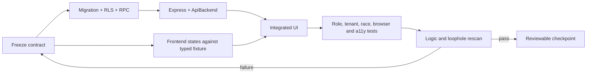

# V1 implementation work breakdown

This document turns the five approved phases into small work packets that can
be assigned without allowing frontend, API, and database behavior to drift.
It is a delivery board, not evidence that any packet is complete.

## 1. Delivery rule for every packet

The contract editor checkpoints shared types, DTOs, Zod schemas, actions,
errors, authorization, versions, and idempotency first. Backend and frontend
may then work in parallel. Frontend fixtures stay at component boundaries and
must never become runtime fake data. A packet is not done until the independent
rescan has tried direct Supabase access as well as the Express path.

## 2. Lane ownership

| Lane | Recommended owner | Primary files | Merge responsibility |
| --- | --- | --- | --- |
| Contract/product | One nominated editor | `packages/shared`, active plan | Freeze request/response/action vocabulary. |
| Data/security | Codex/backend | forward migrations, SQL tests | Constraints, RLS, RPCs, audit/outbox. |
| API/adapter | Codex/backend | `apps/api`, `ApiBackend` | Second-layer authorization and stable errors. |
| Frontend | Claude/frontend | `apps/web` routes/components/CSS | Honest role UI, async states, accessibility. |
| Adversarial QA | Independent agent or human | tests and evidence only initially | Attempt bypass, race, replay, stale and foreign-tenant cases. |

High-conflict files have one editor per packet: `types.ts`, shared schemas,
`services.ts`, `App.tsx`, navigation config, Express router registration,
migrations, and global theme tokens.

## 3. Immediate safety queue (part of Phase 1)

These packets precede visual dashboard expansion because current behavior can
otherwise expose or accept invalid state.

| Packet | Requirements | Outcome | Depends on | Lanes that may run together |
| --- | --- | --- | --- | --- |
| P1-01 Baseline and vocabulary | SEC-01, SEC-02 | Reproduce the current role matrix; remove legacy appointment status names from queries and metrics. | None | QA inventories while contract editor freezes vocabulary. |
| P1-02 Professional access lock | ID-01, SEC-03 | Pending, rejected, or suspended barber/owner can access only verification status/submission, help, and sign out. Customer privileges are not inherited. | P1-01 | Backend and lock-screen frontend after contract freeze. |
| P1-03 Employment-aware revocation | SEC-01, SEC-03, MSG-01 | RLS and Express require verified identity plus current active employment; former/suspended staff lose shifts, attendance, and chat access immediately. | P1-02 | SQL and API in sequence; frontend session-expiry state parallel. |
| P1-04 Close direct-write bypasses | SEC-02, BOOK-01 | Revoke unsafe authenticated appointment insert/update paths; all creation uses one invariant-complete transactional command. | P1-01 | SQL/RPC first, then API/adapter. |
| P1-05 Admin boundary | ID-03, SEC-01 | Server-provisioned MFA admin uses explicit review assignments/capabilities, never owner helpers or public onboarding. Evidence access and decisions are audited. | P1-02 | Admin contracts, backend and minimal admin UI. |
| P1-06 Public/private catalogue split | SHOP-02, SEC-01 | Anonymous discovery receives an allowlisted public projection; private/owner fields remain authenticated and shop-scoped. | P1-01 | API projection and discover UI. |
| P1-07 Phase-1 adversarial gate | all Phase 1 | Direct JWT/RLS and API matrix passes for anonymous, foreign, pending, former, suspended, owner and admin identities. | P1-02 through P1-06 | Independent QA only. |

### Phase 1 review slices

1. Review P1-01 and P1-04 together as the urgent integrity patch.
2. Review P1-02 and P1-03 as one access-revocation journey.
3. Review P1-05 separately because admin evidence access is high risk.
4. Review P1-06 with exact public JSON examples.
5. Run P1-07 from a clean local Supabase reset before Phase 2.

## 4. Phase 2 — shops, workforce, and authoritative availability

| Packet | Requirements | Backend/data result | Frontend result | Depends on |
| --- | --- | --- | --- | --- |
| P2-01 Shop lifecycle | SHOP-01, SHOP-02 | Enforce one owner/one shop; draft, review, published, suspended and closed states; timezone and version. | Guided Shop Setup/resume/edit and honest unpublished dashboard. | Phase 1 |
| P2-02 Shop facts | SHOP-03 | Address/geopoint, hours, closures, media, services, policies and chair count with public projections. | Accessible setup steps, map pin, media/service editors and validation. | P2-01 |
| P2-03 Hiring state | HIRE-01 | `off/open/full`, optional positions/note, atomic fill calculation and fresh queries. | Owner toggle plus distinct hiring map/list/badge/detail. | P2-01 |
| P2-04 Employment convergence | HIRE-02, HIRE-03 | Applications, invitations and join codes create pending requests; owner approval atomically checks vacancy and one active employment. Codes expire, rotate and resist replay. | Barber search/profile/contact/apply; owner candidate review; clear pending/full states. | P2-03 |
| P2-05 Provider capabilities | Q2, Q7, AVAIL-01 | Owner-as-provider, barber service qualifications, accepting state and auditable grants. | Owner provider setup and qualification management; barber read-only capability view/request. | P2-04 |
| P2-06 Schedule authority | STAFF-01 | Owner-authored shifts; barber submits change request; approval transaction applies schedule. Exceptions/absence are conflict checked. | Compact staff calendar, request/approve UI, notes visibility. | P2-04 |
| P2-07 Availability engine | AVAIL-01, AVAIL-02, BOOK-02 | One transactional quote/claim engine combines publication, hours, closure, employment, verification, qualification, shift, absence, duration/buffer, provider/customer overlap and chairs. | Customer slots explain unavailable/preferred/exact/any outcomes without guessing. | P2-02, P2-05, P2-06 |
| P2-08 Phase-2 race gate | all Phase 2 | Parallel last-vacancy, provider-slot and chair-slot claims produce one valid winner and stable conflicts. | Responsive owner/barber/customer smoke journeys. | P2-07 |

## 5. Phase 3 — booking and live operations

| Packet | Requirements | Outcome | Depends on |
| --- | --- | --- | --- |
| P3-01 Request/accept/assign | BOOK-01, BOOK-03 | Manual approval default, optional instant mode, 15-minute expiry, exact/preferred/any intent, assignment and audit. Owner gets accept/decline/assign actions. | P2-07 |
| P3-02 Change and disruption | BOOK-03, VISIT-02, EXC-01 | Reassignment, service change, delay, shop closure, cancellation and reschedule preserve policy snapshots and customer consent. | P3-01 |
| P3-03 Check-in and visit | VISIT-01 | QR/code check-in, checked-in, in-progress, finish, customer confirmation, timeout and dispute use versioned commands/events. | P3-01 |
| P3-04 No-show and appeals | EXC-01 | Owner or assigned provider may mark after grace; reason, evidence, appeal and upheld-strike policy are auditable. | P3-03 |
| P3-05 Walk-ins | WALK-01 | Staff walk-in, OTP/short-code claim, guest fallback and later account linking reuse the same visit facts. | P3-03 |
| P3-06 Offline payments | PAY-01 | Collection, correction and refund facts are separate from appointment state; capability is narrow and every change auditable. | P3-03 |
| P3-07 Outbox and notifications | NOTIF-01 | State transition and outbox commit atomically; retries are idempotent; user preferences do not suppress required operational inbox events. | P3-01 through P3-06 |
| P3-08 Durable closeout | CLOSE-01 | Expiry, no-show-review and completion jobs use leases/idempotency and never infer attendance or payment. | P3-07 |
| P3-09 Phase-3 journey gate | all Phase 3 | Customer, barber and owner finish happy, cancel, late, no-show, disruption, walk-in, payment and retry scenarios without SQL/manual repair. | P3-08 |

## 6. Phase 4 — trust, insights, settings, and role workspaces

| Packet | Requirements | Outcome | Depends on |
| --- | --- | --- | --- |
| P4-01 Conversation membership | MSG-01, SEC-03 | Context-scoped customer/shop and staff chat; active membership is rechecked; retention/archive rules are explicit. | Phase 3 |
| P4-02 Disputes/moderation | TRUST-01 | Owner-first case, customer escalation, assigned admin review, deadlines as targets and immutable decision history. | P3-03 |
| P4-03 Ratings | RATE-01, RATE-02 | Only verified completed visits unlock one shop and one actual-provider rating; seven-day edit, version history, response and appeal. | P3-03, P4-02 |
| P4-04 Analytics facts | DATA-01 | Defined queries for completed service value, payments, visits, cancellations, no-shows, ratings, top visitors/services and attendance. No estimated value is labelled revenue. | P3-06 |
| P4-05 Owner workspace | UX-01, UX-02 | Hamburger navigation; overview charts, reservations actions, staff schedules/attendance/notes, performance, messages, hiring and Shop Setup. | P4-01, P4-04 |
| P4-06 Barber workspace | UX-01, UX-02 | Today queue, lifecycle actions, schedule/change requests, hiring/employment, messages, performance and role-appropriate settings. | P4-01 |
| P4-07 Customer workspace | UX-01, UX-02 | Discover, availability, booking tracking/actions, check-in, history, rating, messages, favorites and settings. | P4-01, P4-03 |
| P4-08 Settings and access | UX-02, A11Y-01 | Identity/contact/security/notifications/privacy/session/accessibility settings are real commands, not decorative controls. | P4-05 through P4-07 |
| P4-09 Phase-4 experience gate | all Phase 4 | Role journeys pass at 320 px, tablet, desktop, keyboard, screen reader, 200% zoom and reduced motion with all async/error states. | P4-08 |

## 7. Phase 5 — production hardening and rollout

| Packet | Requirements | Outcome | Depends on |
| --- | --- | --- | --- | --- |
| P5-01 Job/runtime hardening | OPS-01 | Scheduler/worker survives API restarts and scale-out; leases, retry/dead-letter and alerts exist. | Phase 4 |
| P5-02 Privacy/retention | OPS-01 | Evidence, messages, operational facts and logs follow approved retention, export, deletion and legal-hold rules. | P5-01 |
| P5-03 Security release gate | SEC-01 through SEC-03 | Secret/dependency scan, direct-RLS matrix, object-storage probes, abuse/rate-limit tests and incident runbook pass. | P5-01 |
| P5-04 Reliability gate | OPS-01 | Clean migration, backup/restore, rollback, load, timeout, network and provider-failure drills meet accepted RPO/RTO. | P5-01 |
| P5-05 Release candidate | REL-01 | All roles complete clean-environment journeys without seed accounts, SQL or service-role intervention. | P5-02 through P5-04 |
| P5-06 Pilot rollout | REL-01 | Staged rollout, telemetry review, support ownership and stop/rollback thresholds are active. | P5-05 |

## 8. Logic-rescan gate used after every packet

The QA lane repeats these probes after integration:

1. **State:** illegal transition, terminal-state mutation, stale version, timer boundary and retry.
2. **Identity:** anonymous, wrong role, pending, rejected, suspended and restored.
3. **Tenant:** guessed foreign UUID, same role/different shop, former staff and reassigned staff.
4. **Direct database:** repeat sensitive reads/writes with an authenticated JWT and prove RLS independently of Express.
5. **Race:** double submit, two approvals, final vacancy/chair/slot, worker plus user command and notification retry.
6. **Truth:** displayed status/metric is derived from authoritative facts and uses the approved label.
7. **Failure:** database/API/storage/provider timeout, partial failure, refresh, offline draft and recovery.
8. **Privacy:** response projection, logs, exports, upload URLs, deletion and retained audit facts.
9. **Usability:** missing action, misleading disabled state, no recovery path, keyboard/focus/announcement and mobile layout.
10. **Operations:** job ownership, lease, idempotency, alert, reconciliation and manual support path.

Each failure becomes a dated `LR-###` row in the rescan report. A P0 blocks all
dependent packets; a P1 blocks its phase gate; a P2 must have an owner and due
phase; P3 may enter the post-V1 backlog.

## 9. Safe next assignment

Start with **P1-01 + P1-04**. They repair current booking truth without asking
the frontend to redesign unstable workflows. In parallel, the frontend lane
may prepare the P1-02 verification lock screen from the frozen access-state
contract, but it must not change operational routes until backend denial tests
pass.
