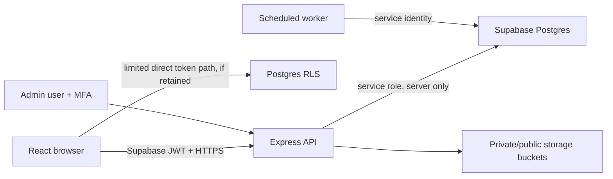

# Backend, data, and security master specification

This document defines the backend contract required by the five-phase plan. It
is written for agents working in `packages/shared`, `supabase`, and `apps/api`.

## 1. Trust boundaries



- Browser is untrusted. Route guards and hidden buttons are UX only.
- Express verifies Supabase JWT, loads the trusted profile/capabilities, applies
  authorization, validates Zod input, then uses service role.
- RLS independently protects direct authenticated database access and mistakes
  in future clients.
- Service role bypasses RLS; every Express/worker query must be explicitly
  scoped and reviewed.
- Admin access is exceptional, MFA-protected, least-privilege, and audited.

## 2. Canonical command pattern

Sensitive writes use a command/RPC, not arbitrary table mutation:

1. Parse and validate shared DTO.
2. Authenticate actor and fetch effective capability/suspension.
3. Resolve target and shop scope without trusting body-supplied owner/user IDs.
4. Check expected version and command-specific policy.
5. Lock relevant rows/capacity/advisory key.
6. Recheck invariant inside transaction.
7. Write state, append immutable event, and enqueue notifications atomically.
8. Return allowlisted projection with new version and allowed actions.
9. Map known database errors to consistent JSON; log correlation ID, not secrets.

Creation/correction/decision commands accept an idempotency key with a unique
scope such as `(actor_id, command_type, idempotency_key)`.

## 3. Current critical repairs

Before feature migrations:

- Replace `/availability/slots` query status `pending` with canonical blocking
  statuses.
- Replace performance query `no_show` with `customer_no_show` and correct
  attribution.
- Narrow/remove legacy status writes and plan removal of compatibility aliases.
- Close direct appointment insert/update path that bypasses full bookability.
- Make appointment event history append-only.
- Recheck former/suspended staff on conversations and commands.
- Define future-booking resolution before employment can end.
- Reconcile stale schema/service fields and current docs.

## 4. Domain table plan by phase

| Phase | Add/extend |
| --- | --- |
| 1 | verification submissions/documents/events, account capabilities, admin/evidence access audit, idempotency records as needed. |
| 2 | shop lifecycle/hours/closures/media/policy versions, service qualifications, job profiles, unified employment requests/events, secure join codes, provider/customer/chair capacity support, barber preference/assignment fields. |
| 3 | change proposals, disruption batches, attention items, closeout runs, walk-in entries/claims/events, payment records/events, notification outbox/deliveries/in-app notifications, no-show appeals/restrictions. |
| 4 | support/moderation cases/evidence/events, rating responses/reports/moderation, blocks/reports, metric views/materializations, settings/session/privacy records. |
| 5 | no new business domain; operational leases/dead letters/audit partitions only if required for hardening. |

Use normalized columns for authoritative queryable facts. Versioned allowlisted
JSON is acceptable for policy/evidence metadata whose schema is validated and
stored with a version; it is not a substitute for tenant keys or status columns.

## 5. Core invariants

### Identity and shops

- Public role selection cannot set `role`, `verification_status`, capability, or
  admin status.
- One owner shop in V1; enforce, do not merely choose the first record.
- Only published shops appear in public catalogue queries.
- Shop-scoped provider/cashier capability cannot be used at another shop.
- Suspended/rejected/pending professional cannot perform professional commands.

### Employment and scheduling

- One active ordinary-barber employment.
- Accepted employment request and active stint are created atomically.
- Ending/suspending stint is blocked until affected future bookings are resolved
  by a transactional plan.
- Owner is schedule authority; approved change request applies the shift change.
- Private exception reason and staff notes never enter public availability.

### Booking/capacity

- Service belongs to shop, is active, qualified provider belongs to shop, and
  final provider/time fits all Phase 2 availability inputs.
- Active states block provider/customer/chair capacity.
- Requested hold releases on expiry/cancel/decline.
- Exact replacement and material changes require recorded customer consent.
- Service/policy/provider snapshots preserve historical truth.
- Versioned transition and event insert are atomic.

### Walk-ins and payment

- QR/claim tokens and OTPs are stored hashed, expire, are attempt-limited, and
  cannot be reused.
- Rating eligibility requires completed linked visit and verified claim.
- Payment fact never sets appointment completion; appointment completion never
  proves collection.
- Corrections/refunds append events and maintain integer cents/currency.

### Ratings/trust

- One review per eligible visit; separate shop/provider scores.
- Actual provider receives barber score.
- Seven-day customer edit cutoff is enforced server/database side.
- Moderation can hide text without deleting score/event.
- Foreign, unresolved, or duplicate visit cannot create rating.

## 6. RLS/authorization matrix

| Resource | Customer | Barber/provider | Owner | Admin/worker |
| --- | --- | --- | --- | --- |
| Own private profile/settings | Own only | Own only | Own only | Audited support only |
| Verification/evidence | Own submission/status; own upload path | Same | Same | Assigned reviewer; audited short access |
| Published catalogue | Read | Read | Read | Moderate |
| Draft/suspended shop | No | Active staff only if explicitly needed | Owning owner | Admin |
| Booking/events | Own participant record | Assigned/eligible own-shop record | Own-shop record | Escalated/audited support |
| Walk-in claim | Token-scoped own claim | Assigned/own-shop operations | Own-shop operations | Abuse/support only |
| Employment/shift/attendance | No | Own stint/history allowed | Own shop | Audited support |
| Hiring request | No | Own requests/profile | Own shop requests | Abuse review |
| Conversation/message | Participant/context only | Participant/context only | Own-shop participant | Exceptional audited access |
| Rating public projection | Read | Read | Read/respond | Moderate |
| Payment/receipt | Own linked visit projection | Cashier if granted | Own shop | Reconciliation/support |
| Analytics | Own personal history | Own performance | Own shop | Aggregate operations only |

RLS test cases must use real role JWTs and direct PostgREST/Supabase calls, not
service role. Express tests repeat the same matrix because neither layer
substitutes for the other.

## 7. API conventions

- Prefix `/api/v1`.
- Success: `{ "data": ... }`; error: stable shape containing safe code/message,
  field issues when applicable, and request/correlation ID.
- No stack trace, SQL text, internal table names, provider secret, or evidence
  path in client errors.
- Cursor pagination for unbounded collections; stable sort plus unique tie-break.
- Timestamps are UTC ISO; date/time input is interpreted using explicit shop
  IANA timezone. Prices/amounts are integer cents and currency code.
- Mutations use expected version where concurrent edits matter and
  `Idempotency-Key` or shared body field for replayable creates.
- Return allowed actions/deadlines when it prevents UI rule duplication.
- Rate-limit auth, OTP, join-code, messaging, upload, review report, and admin
  evidence access more aggressively than ordinary reads.

## 8. Shared service domains

Target `DataBackend` remains the UI seam and may be grouped as:

```text
auth
verification
admin
shops (public + owner management)
services
media
hiring
employment
staff/scheduling
availability
bookings/visits
walkIns
chat
notifications
reviews/moderation
payments
analytics
favorites
settings/privacy
support
```

Avoid a single giant adapter method file where feasible, but preserve one
injected backend object and consistent errors. Every implemented method has a
shared DTO/schema and contract test.

## 9. Storage security

| Bucket/content | Visibility | Rules |
| --- | --- | --- |
| Shop public media | Public only after moderation/publication | Validated image type/size/dimensions, safe generated name, alt metadata. |
| Verification evidence | Private | Applicant upload grant; reviewer short signed view; scan/checksum/audit/90-day purge. |
| Case evidence | Private | Case participant upload; authorized reviewer short access; legal/retention policy. |
| Portfolio | Public or authenticated according to profile visibility | No precise private location or identity document reuse. |

Never use user-provided filenames as storage keys or render uploaded SVG/HTML.
Validate actual file signature, not only declared MIME.

## 10. Background jobs

| Job | Trigger/key | Safe behavior |
| --- | --- | --- |
| Request expiry | `appointment_id + expires_at` | Transition only still-requested matching version. |
| Completion timeout | `appointment_id + due_at` | Complete only valid awaiting-confirmation visit. |
| Closeout | `shop_id + local_date` unique | Safe transitions + attention items; never guess. |
| Notification delivery | outbox ID/idempotency | Retry/backoff; record attempt; dead-letter/alert. |
| Evidence purge | document ID/purge date | Respect legal hold; retain decision audit. |
| Retention/anonymization | policy/domain/date | Bounded batches, resumable, verified counts. |
| Aggregate refresh | shop/date/version | Rebuild from source facts; detect drift. |

Jobs need leases/locks, heartbeat, lag metric, retry ceiling, and runbook. A
minute interval inside one Express process is not sufficient for production.

## 11. Audit and correction

Audit events include actor, effective role/capability, shop/resource scope,
command/event type, from/to state, reason, allowlisted metadata, request ID, and
timestamp. Do not log secrets, OTP, raw document path, or message body.

Facts corrected after the event—attendance, payment, no-show, employment,
service amendment, dispute, moderation—use explicit correction commands/events.
If a current-state column is updated for efficient reads, the event remains the
explanation and aggregate rebuild source.

## 12. Retention, deletion, and backup

- Implement policy values from the product contract as configurable constants,
  not scattered literals.
- Account deletion anonymizes retained operational/financial facts rather than
  breaking references or audit.
- Export includes the user's allowlisted data, not other participants' private
  fields or internal reviewer notes.
- Legal holds suspend purge with reason and reviewer; hold access is audited.
- Backup retention and restore procedures are included in deletion/privacy
  review; document what cannot disappear immediately from immutable backups.

## 13. Migration discipline

For every phase:

1. Add forward migration with explicit constraints/indexes/RLS/grants.
2. Backfill in bounded, verifiable steps.
3. Support compatibility read/write only for a documented window.
4. Switch shared/API/UI consumers.
5. Run data/RLS verification queries.
6. Remove legacy source in a later migration after evidence of zero use.

Never edit an applied migration or use destructive reset against user data.
Every risky migration includes a compensating plan and production verification
query.

## 14. Backend definition of done per slice

- Shared DTO/Zod/type/pure rule exists and compiles.
- Migration has keys, constraints, indexes, RLS, grants, and verification query.
- Express verifies JWT, capability, shop scope, input, version, and idempotency.
- Transaction writes state/event/outbox atomically where relevant.
- Public/private response fields are explicitly projected.
- `ApiBackend` and retained adapters satisfy contract.
- Unit, DB, direct RLS, API, concurrency, idempotency, and adapter tests pass.
- No secret/hardcoded account, unbounded list, service-role browser variable,
  legacy status drift, or history overwrite.
