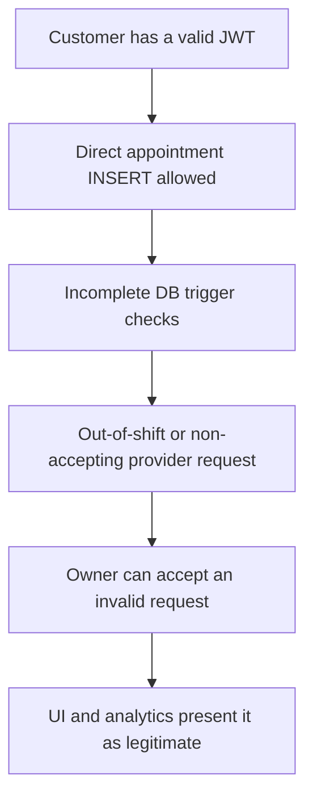
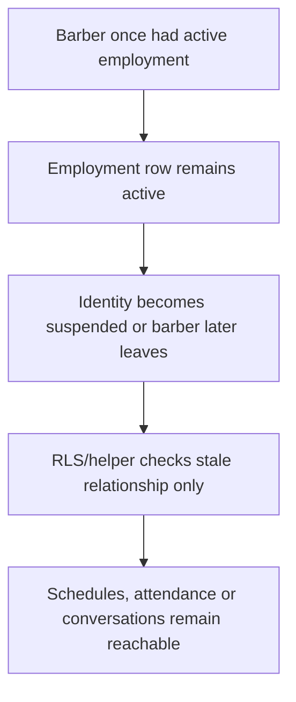

# Logic and loophole rescan — 2026-07-22

This is a static current-state audit against the approved V1 contract. It does
not claim runtime exploitation or test completion. Line numbers can move; the
named functions, routes and migrations are the durable evidence anchors.

## Severity

- **P0:** active integrity/security failure; repair before dependent feature work.
- **P1:** phase-blocking authorization, lifecycle, privacy or correctness gap.
- **P2:** reliability/performance/maintainability gap with a required owner.
- **P3:** improvement or post-V1 candidate.

## Confirmed current gaps

| ID | Pri | Failure/loophole | Current evidence | Required packet |
| --- | --- | --- | --- | --- |
| LR-001 | P0 | Availability queries legacy `pending`, which is not in the canonical appointment enum, and omits active blocking states. Local Supabase can reject the query or return unsafe slots. | `apps/api/src/routes/availability.ts`, appointment status query; `20260718000100_appointment_lifecycle.sql` | P1-01, P2-07 |
| LR-002 | P0 | Authenticated customers can insert appointments directly under RLS and bypass the API's schedule/accepting checks. The trigger validates references and time but not the complete availability invariant. | `20260717000300_row_level_security.sql` appointment grants/policy; `private.prepare_appointment()` | P1-04 |
| LR-003 | P1 | Pending/rejected/suspended barber access is not absolutely locked; the shared/API lock only handles owners and the barber UI exposes hiring. | `packages/shared/src/accounts.ts`; `requireOperationalAccess`; `AppDashboardPage.tsx` | P1-02 |
| LR-004 | P1 | Conversation access trusts the stored barber participant forever. A resigned/terminated barber can retain customer/staff chat unless employment is rechecked. | `private.is_conversation_participant`; `requireConversationAccess`; `/conversations` barber query | P1-03, P4-01 |
| LR-005 | P1 | The RLS active-barber helper checks employment but not current verified, non-suspended professional identity. Suspension does not automatically end old employment. | `private.is_active_barber_for_shop`; employment validation trigger | P1-03 |
| LR-006 | P1 | Admin is passed through owner authorization helpers that still require `owner_id = admin user id`; some create routes can instead treat admin as a shop owner. | `requireOwnedShop`; catalogue shop-create role checks | P1-05 |
| LR-007 | P1 | The V1 one-owner/one-shop rule is not enforced; the uniqueness rule only prevents duplicate owner/name pairs and the API can create another differently named shop. Owner lookup then chooses an arbitrary first row. | shops constraint; `POST /shops`; `requireOwnedShop(...).limit(1)` | P2-01 |
| LR-008 | P1 | Public discovery is mounted after mandatory JWT middleware, while `ApiBackend.shops.list/get` authenticate by default. Signed-out discovery cannot use the API backend. | `apps/api/src/app.ts`; `ApiBackend.request`; `shops.list/get` | P1-06 |
| LR-009 | P1 | Catalogue selection has no publication lifecycle and currently exposes every shop row to authenticated catalogue reads. | shops select RLS policy; `GET /shops` | P1-06, P2-01 |
| LR-010 | P1 | “Open/available” is derived mostly from barber toggle/shift rows and ignores shop hours, closures, current appointment occupancy and chair capacity. | catalogue shop-status computation | P2-07 |
| LR-011 | P1 | Barber and owner both directly edit the same schedules, creating last-write-wins authority conflicts instead of barber change requests. | availability barber and owner shift routes | P2-06 |
| LR-012 | P1 | Approving a shift-change request changes request status but does not transactionally apply the requested schedule. | employment shift-change resolution route | P2-06 |
| LR-013 | P1 | A join code immediately creates active employment instead of a pending owner-approved request. Codes are plaintext, without expiry/usage semantics or dedicated abuse controls. | `POST /employment/join`; `shop_join_codes` get/rotate | P2-04 |
| LR-014 | P1 | Barber performance compares status to legacy `no_show`; canonical customer status is `customer_no_show`, and customer absence should not silently become barber fault. | `apps/api/src/routes/account-data.ts` performance calculation | P1-01, P4-04 |
| LR-015 | P1 | Ratings can be upserted/edited indefinitely and customer RLS permits update/delete without the approved seven-day window/version history. | ratings route and rating RLS policies | P4-03 |
| LR-016 | P1 | Appointment cancellation allows the assigned barber, while the target workflow needs an explicit shop/provider cancellation policy and reason classification. This is implemented as a generic legacy cancel. | bookings `/cancel`; lifecycle `when 'cancel'` | P3-02 |
| LR-017 | P1 | Only the assigned barber may mark customer no-show; the approved target also permits the owning owner after grace. | bookings `/no-show`; lifecycle `mark_customer_no_show` | P3-04 |
| LR-018 | P1 | Lifecycle jobs run inside each API process on a timer. Jobs stop when API is down and duplicate across replicas; there is no durable lease/alert ownership. | `apps/api/src/server.ts` interval worker | P3-08, P5-01 |
| LR-019 | P1 | Appointment and shop-booking lists fetch unbounded history; conversation summaries load every message across every conversation before filtering in memory. | booking list routes; `withMessageSummary()` | P4-01, P4-04 |
| LR-020 | P1 | API projections use `shops(*)` in appointment/conversation joins. Adding private shop fields later could silently leak them through existing endpoints. | appointment and conversation select strings | P1-06 |
| LR-021 | P2 | Shop/time computations hardcode `Asia/Manila`/`+08:00` instead of persisting and consuming shop timezone. | availability, catalogue and booking date logic | P2-01, P2-07 |
| LR-022 | P2 | Auth email changes update Supabase Auth before the public profile; a later profile failure can leave identity records inconsistent without compensation. | auth profile update route | P1-01 or P5-04 |
| LR-023 | P2 | `appointment_events` is intended as history, but service-role grants still permit update/delete and no database immutability guard protects accidental privileged rewrites. | lifecycle migration event grants | P1-04, P5-03 |
| LR-024 | P2 | Completed service value has a compatibility `revenue_cents` name even though collection/refund facts do not yet exist. UI may overstate revenue. | account stats compatibility response | P4-04 |
| LR-025 | P2 | General rate limiting is not sufficient for high-value actions such as join-code attempts, verification decisions, check-in codes and lifecycle replay. | central Express limiter; route-specific absence | P1-05, P2-04, P3-03, P5-03 |
| LR-026 | P1 | A create command can lock the schedule rows it sees, but an absent exception/pattern is a phantom and current schedule writers do not share its lock. A concurrent schedule edit can invalidate the decision. | interim `api_create_appointment`; current schedule write routes/RPC | P2-06, P2-07 |
| LR-027 | P2 | Event rows are append-only and direct event insertion is removed, but service-role still retains raw appointment `UPDATE` for current worker-fixture needs. A privileged application mistake could change state without a matching event. | lifecycle function security mode and service-role grants | later P1 command hardening, P5-03 |
| LR-028 | P2 | Barber performance now uses explicit customer-no-show fields, but the endpoint has no frozen shared response DTO and its denominator remains a Phase-4 metric decision. | account-data performance route | P4-04 |
| LR-029 | P0 | Participant reads and API `*` projections exposed `check_in_code_hash`, enabling offline guessing of a six-digit check-in code. | appointment grants and booking response projection | P1-04 |
| LR-030 | P1 | Express booking creation checked only effective `customer` role, so a pending professional account could reach the privileged command and relied solely on its SQL rejection. | `POST /bookings` authorization | P1-02, P1-04 |
| LR-031 | P1 | Booking creation has no maximum advance horizon or per-customer outstanding-request cap, so one account can hoard many non-overlapping future slots until requests expire. | creation command and general IP limiter | P2-07, P3-01, P5-03 |
| LR-032 | P2 | Adding the customer-overlap exclusion constraint aborts if a populated environment already contains conflicting active rows. Deployment needs an explicit preflight and human resolution; it must not silently discard appointments. | `20260722000100_secure_appointment_commands.sql` | P1-04, P5-04 |
| LR-040 | P1 | Hiring-listing openness is checked in Express before `api_create_barber_application`; a concurrent owner close can still admit an application after hiring closes. | employment application route and `api_create_barber_application` | P2-04 hiring/application transaction |

## First repair pass — implementation status

| Finding | Implemented change | Evidence now | Closure state |
| --- | --- | --- | --- |
| LR-001 | One shared canonical capacity-blocking status list now drives availability and booking overlap queries. | Shared, route, and local-Supabase query tests pass. | **Green.** |
| LR-002 | Browser and service-role raw appointment creation is revoked. Express calls a service-role-only `SECURITY DEFINER` command that derives snapshots and checks the Phase-1 invariants. | Direct-RLS, RPC, schedule, and race tests pass after a clean reset. | **Green for Phase 1.** |
| LR-014 | Performance counts `customer_no_show` and names it as a customer operational signal rather than barber fault. | Focused API test passes. | **Implemented; metric contract remains LR-028.** |
| LR-023 | Event update/delete/truncate is guarded; appointment deletion is revoked so cascade cannot erase history. | Direct privileged mutation and retained-history tests pass. | **Green.** |
| Newly found customer overlap | A GiST exclusion constraint covers the same five active states for each customer, including create/reschedule/reassign races. | Sequential and concurrent local-Supabase probes pass. | **Green.** |
| LR-029 | Browser JWTs receive column-level appointment grants excluding the hash; every Express appointment projection is explicit or defensively strips it. | API leak regression and direct column-denial tests pass. | **Green.** |
| LR-030 | Express now requires a completed, non-verification customer identity before invoking the creation command. | Pending-professional route test passes and proves the RPC is not called. | **Implemented.** |
| LR-027 (partial) | Existing lifecycle functions run as hardened definers and service-role direct event insertion is revoked. | Direct privileged event-insert denial and normal timeline tests are authored. | **Raw appointment UPDATE remains tracked.** |
| LR-035 | Authenticated direct writes bypassed the new shift capability, pattern, exception, change-request, message, and read-marker commands. | Migration 007 revokes the column/table grants and drops permissive write policies; verified-active JWT denial and Express success paths pass. | **Green.** |
| LR-036 | Reassignment validated mutable live service state/duration but preserved the original snapshot, so retired services were blocked and shortened services could overrun a shift. | Reassignment now validates the booked duration without requiring the service to remain active; retired/shortened service integration test passes. | **Green.** |
| LR-037 | Lifecycle transitions locked the appointment row before the barber lock while reschedule/reassign used the reverse order, permitting a deadlock cycle. | Per-appointment command wrappers serialize lifecycle/reschedule/reassign before capacity and row locks; concurrent transition/reschedule test yields one success and one stale-version result, never `40P01`. | **Green.** |
| LR-038 | Staff commands and join-code eligibility read verification without locking the profile/barber rows, so suspension could race the command. | Verification/profile rows are locked during current-employment checks and employment creation; suspended command/join denial passes. | **Green for current command boundary; audited suspension RPC remains P1-05.** |
| LR-039 | Direct barber-application INSERT/UPDATE could bypass the atomic application/employment commands. | Authenticated application writes are revoked and their write policies removed; direct-JWT denial passes. | **Green; LR-040 still tracks the listing-close race inside the server command.** |

The appointment creation command is deliberately an **interim Phase-1
integrity command**, not the final Phase-2 availability engine. Shop
publication, hours, closures, persisted timezone, qualifications, buffers,
chairs, lead/advance policy, and schedule-writer serialization remain P2-07.

## Highest-risk failure chains

## Items that need runtime proof during the first gate

1. Run a clean migration reset and call the availability endpoint with at least
   `requested`, `confirmed`, `checked_in`, `in_progress`, and
   `awaiting_confirmation` appointments.
2. Attempt direct customer-JWT inserts outside a shift, while
   `accepting_bookings=false`, and into a closed/unpublished shop.
3. Suspend and terminate a barber after conversation creation, then test read,
   send, mark-read, shifts and attendance through both RLS and Express.
4. Browse discovery with no session and inspect the exact public JSON fields.
5. Create two owner shops concurrently and join the last vacancy concurrently.
6. Replay appointment commands with stale versions and duplicate idempotency
   keys while the lifecycle worker runs.

## Rescan record template

Append a row after each integrated packet; do not overwrite historical rows.

| Date | Packet/commit | Probe | Actor/tenant | API result | Direct-RLS result | Race/retry result | New LR IDs | Verdict |
| --- | --- | --- | --- | --- | --- | --- | --- | --- |
| 2026-07-22 | Planning baseline | Static inspection | All roles | Not run | Not run | Not run | LR-001–LR-025 | Fails; begin P1-01/P1-04 |
| 2026-07-22 | P1-01/P1-04 working tree | Unit/static pass | Customer, provider, owner, service role | Express unit pass | Test authored; Docker off | Test authored; Docker off | LR-026–LR-028 | Partial pass; do not close until clean Supabase run |
| 2026-07-22 | P1-01/P1-02-lock/P1-04 integrated tree | Clean migration plus full automated gate | Customer, active/pending/rejected/suspended professionals, owner, cross-shop actors, service role | API 26/26 | Docker-backed suite 10/10 | Provider/customer competing claims passed | LR-029–LR-032; no new backend LR | P1-04 green; backend lock green; Phase 1 remains open |
| 2026-07-22 | P1-03/P1-06 adversarial hardening through migration 007 | Clean migration, command-boundary, snapshot, and lock-order gate | Anonymous, customer, current/former/suspended barber, owner, foreign tenant, service role | API 42/42 | Docker-backed suite 22/22 | Employment/capability, provider/customer claim, and transition/reschedule races passed | LR-035–LR-040 | P1-03/P1-04/P1-06 green; LR-040 deferred to Phase 2; Phase 1 remains open on P1-02/P1-05/P1-07 |

## Integrated browser findings — 2026-07-22

| ID | Pri | Failure/loophole | Runtime evidence | Required packet |
| --- | --- | --- | --- | --- |
| LR-033 | P1 | A pending professional briefly sees the public landing/sign-in route while the saved session/profile restores, before redirecting to `/verification`. | Browser smoke: immediately after `DOMContentLoaded`, `/` contained the complete public lifecycle page; about one second later it redirected to the barber lock. | P1-02 frontend follow-up |
| LR-034 | P1 | Verification UI claims “Registration received”, “Under review”, and a review queue although role onboarding creates no submission, evidence, or review case. | Pending owner and barber lock screens against the real API/local Supabase. | P1-02 verification contract plus frontend follow-up |

Positive browser evidence from the same run: owner and barber operational deep
links were redirected to `/verification`, the hamburger/operational menu was
absent, sign out returned to the public page, the 390 px viewport had no
horizontal overflow, and no browser console warnings/errors were recorded.
The Opus handoff for LR-033/LR-034 is
`docs/plans/CLAUDE-OPUS-4.8-P1-02-FOLLOWUP.md`.

“Pass” requires exact test evidence. A UI screenshot, service-role query, or
successful happy path alone does not close a loophole.
