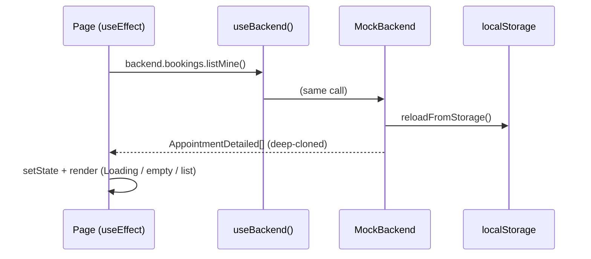
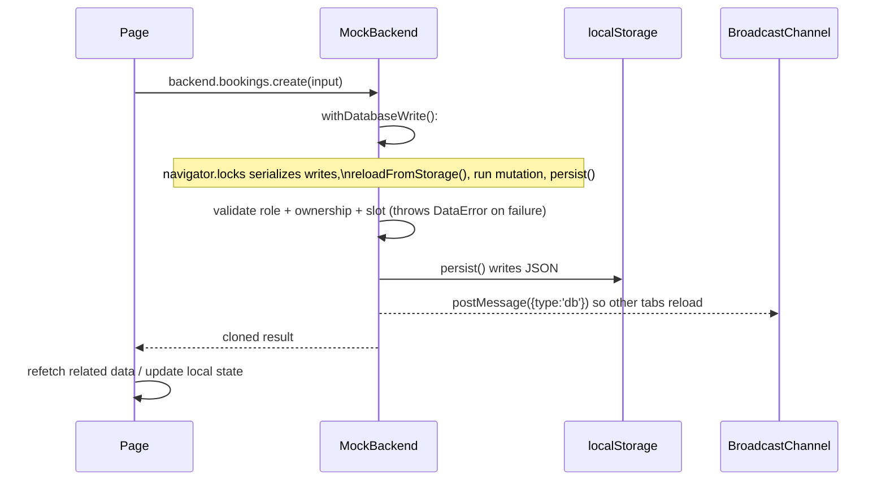

# Philabantay - Architecture Overview

A practical technical map: the stack, the folder layout, where state lives, how
data flows, what talks to what, and the gotchas worth knowing before you change
things.

Pair this with [FEATURES.md](../mdfiles/FEATURES.md) (what each screen does) and the
existing [CODE-PATTERNS.md](CODE-PATTERNS.md), [SECURITY.md](../security/SECURITY.md), and
[ROLE-AND-LOCATION-GUARDRAILS.md](../security/ROLE-AND-LOCATION-GUARDRAILS.md).

---

## Tech stack

| Concern | Choice |
| --- | --- |
| Language | TypeScript (strict, `noUnusedLocals`, `verbatimModuleSyntax`; see `tsconfig.base.json`) |
| UI framework | React 19 |
| Build/dev | Vite (`apps/web/vite.config.ts`) |
| Routing | `react-router-dom` v7 (`BrowserRouter`, declared in `App.tsx`) |
| State management | React Context + local component state. No Redux/Zustand/RTK. |
| Server data | `VITE_DATA_BACKEND` selects the in-app mock or the Express-backed `ApiBackend`; UI components use the same interface for both. |
| Realtime | Mock: `BroadcastChannel`. API: authenticated HTTP polling behind `chat.subscribe`. |
| Maps | Leaflet + OpenStreetMap tiles |
| Animation | GSAP + ScrollTrigger (dynamically imported), plus CSS transitions |
| Styling | Plain CSS, one colocated stylesheet per component/page, shared tokens in `theme/doodle.css` |
| Monorepo | npm workspaces: `apps/*` and `packages/*` |

**Phase 2 local setup complete:** Supabase Postgres/Auth/RLS migrations and the
credential-free local seed live under `supabase/`; the thin Express API lives in
`apps/api`. The frontend HTTP adapter is wired and the Docker-backed local stack
has passed direct RLS, Express API, and three-role browser verification. See
[LOCAL-SUPABASE-VERIFICATION.md](../mdfiles/LOCAL-SUPABASE-VERIFICATION.md).

---

## Monorepo layout

```text
barbersalonhelp/
├─ package.json            npm workspaces; root scripts (dev/build/lint/typecheck)
├─ tsconfig.base.json      shared strict TS config
├─ docs/                   these guides
├─ supabase/               Postgres migrations, RLS policies, local config + seed
├─ packages/
│  └─ shared/              @barbershop/shared: the contract everyone agrees on
│     └─ src/
│        ├─ types.ts         domain entities (Profile, Barber, Shop, Appointment, ...)
│        ├─ dto.ts           request/response shapes + DataError
│        ├─ services.ts      the DataBackend interface (the seam)
│        ├─ validation.ts    field rules shared by form + backend
│        ├─ appointments.ts  pure booking rules (isUpcoming / canModify)
│        ├─ constants.ts     SHOP_NAME, timezone, weekday labels, slot step
│        └─ index.ts         re-exports everything
└─ apps/
   ├─ api/                 @barbershop/api: Express 5 REST API + Supabase clients
   └─ web/                 @barbershop/web: the React app
      └─ src/ ...          see next table
```

Root scripts (`package.json`): `npm run dev` runs the web app; `npm run build`
typechecks `shared` then builds `web`; `typecheck`/`lint` fan out across
workspaces.

### `apps/web/src` structure

| Directory | What it is for |
| --- | --- |
| `main.tsx` | Entry point. Mounts the provider tree (see below). |
| `App.tsx` | All routes. Lazy-loads every page except the landing page. |
| `pages/` | Route-level screens. Each orchestrates loading + mutations for its route. |
| `pages/settings/` | The five settings panels rendered inside the settings shell. |
| `components/` | Reusable and route-specific UI (dashboards, map, chat pieces, avatars, modal, curtain). |
| `features/auth/` | `AuthContext` - the signed-in profile + auth actions. |
| `services/` | The data layer. `backend.tsx` is the provider/switchboard; `services/mock/` is the current implementation. |
| `services/mock/` | `MockBackend.ts` (all service logic), `seed.ts` (initial data + schema), `availability.ts` (slot math), `passwords.ts` (PBKDF2). |
| `hooks/` | Reusable lifecycle behavior: `useLiveLocation`, `useCurrentTime`. |
| `lib/` | Pure utilities: `date`, `geo`, `format`, `security`, `profile`. |
| `config/` | Static metadata: `navigation` and `discovery` (nearby radius). |
| `theme/` | `doodle.css` (tokens + global styles), `DoodleDefs` (SVG icon sprite + rough filters), GSAP animation runtime + hook. |

---

## The one big idea: the `DataBackend` contract

Everything the UI needs from "the server" is expressed as one TypeScript
interface in `packages/shared/src/services.ts`:

```ts
export interface DataBackend {
  auth: AuthService
  barbers: BarberService
  availability: AvailabilityService
  services: ServiceCatalog
  bookings: BookingService
  chat: ChatService
  shops: ShopService
  favorites: FavoriteService
  reviews: ReviewService
  employment: BarberEmploymentService
  support: SupportService
}
```

Pages and components **only ever call this interface**. They never import
anything from `services/mock`. That is the seam that lets Phase 2 replace the
mock with a Supabase adapter without editing a single screen.

```mermaid
flowchart TD
  Pages[pages + components] -->|useBackend()| Contract[DataBackend interface\npackages/shared]
  Pages -->|useAuth()| AuthCtx[AuthContext]
  AuthCtx -->|delegates auth.* to| Contract
  Contract -.implemented by.-> Mock[createMockBackend\nservices/mock]
  Contract -.implemented by.-> Api[ApiBackend\nExpress HTTP]
  Mock --> LS[(localStorage + sessionStorage)]
  Api --> Express[apps/api]
  Express --> Supabase[(Supabase Auth + Postgres)]
```

The switchboard is `services/backend.tsx`:

```ts
const kind = import.meta.env.VITE_DATA_BACKEND ?? 'mock'
// 'mock'     -> createMockBackend()
// 'api'      -> new ApiBackend({ baseUrl: VITE_API_BASE_URL })
// 'supabase' -> alias of 'api' for existing deployments
```

The API cases fail closed when `VITE_API_BASE_URL` is missing. No Supabase
service-role value is accepted through a browser `VITE_` variable.

---

## Bootstrap and provider tree

`main.tsx` wires the providers in a deliberate order (do not reorder):

```tsx
<StrictMode>
  <BackendProvider>        {/* creates one DataBackend for the app */}
    <AuthProvider>         {/* uses the backend -> must be inside it */}
      <BrowserRouter>      {/* router hooks used by App + curtain */}
        <App />
      </BrowserRouter>
    </AuthProvider>
  </BackendProvider>
</StrictMode>
```

`App.tsx` then renders one `<Layout>` route with all pages nested inside it.
`Layout` (`components/Layout.tsx`) provides the sticky header, the hamburger
`AppMenu`, the background, the doodle SVG defs, the `CurtainProvider`, and a
`Suspense` + `RouteErrorBoundary` around the lazy `<Outlet/>`.

---

## Where state lives

There are only three kinds of state, which keeps things easy to reason about:

1. **The signed-in user** - React Context.
   `features/auth/AuthContext.tsx` holds `{ profile, loading, isBarber,
   isShopOwner, isAdmin, signIn, signUp, ... }`. It restores the session once on
   mount and subscribes to `auth.onAuthChange` so the header and route guards
   update together on login/logout. Auth mutations go through here, not through
   `useBackend()` directly.

2. **The data backend instance** - React Context.
   `services/backend.tsx` builds one `DataBackend` with `useMemo` and hands it
   down via `useBackend()`.

3. **Everything else** - local component state.
   Each page fetches what it needs in a `useEffect`, stores it in `useState`, and
   derives the rest with `useMemo`. There is no global cache. If two pages need
   the same data, they each fetch it. The persistent store is the mock DB in
   `localStorage`; React state is just a per-screen view of it.

The convention (from [CODE-PATTERNS.md](CODE-PATTERNS.md)): use `null` for "not
loaded yet" when an empty array is a valid loaded result, and guard async effects
with an `active` flag against stale updates.

---

## How data flows

### Reads (the standard page pattern)



Every mock method starts with an artificial `await delay(...)` and calls
`reloadFromStorage()` so it sees writes from other tabs. Return values are always
`structuredClone`d, so the UI can never mutate the store by reference.

### Mutations



Two rules that hold everywhere:

- **The backend is authoritative.** Even if the UI hides a button, the mock
  re-checks role, ownership, status transitions, dates, and input bounds, and
  throws a typed `DataError` (`dto.ts`) for expected failures. Pages catch it and
  show `error.message`.
- **Business rules are shared, not duplicated.** For example "can this booking
  still change?" is `canModifyAppointment` in
  `packages/shared/src/appointments.ts`, used by both the page (to show actions)
  and the backend (to enforce them).

### Realtime (chat)

`chat.subscribe(conversationId, cb)` keeps the transport behind one synchronous
unsubscribe contract. The mock uses `BroadcastChannel`; `ApiBackend` immediately
delivers messages sent by the current tab and polls the protected messages route
for remote messages. `ChatPage` remains transport-agnostic and cleans up the
subscription on unmount.

---

## Routing and the auth guard

- Routes live only in `App.tsx`. Pages are `React.lazy` with an explicit
  `.then(m => ({ default: m.Named }))` bridge because the pages use named
  exports. The landing page is eager for a fast first paint.
- `components/RequireAuth.tsx` guards private routes in this order: wait for
  session restore (`loading`), then require a profile (redirect to `/login` with
  a `from`), then require completed onboarding (redirect to `/onboarding/role`),
  then enforce the pending-owner verification lock (redirect to
  `/verification`), then optionally require a specific `role`. `Layout` repeats
  the owner lock for normally-public routes, leaving Sign out as the only action.
- Important: `RequireAuth` is **UX only**. It is explicitly documented as *not* a
  security boundary; production security is Supabase RLS
  ([ROLE-AND-LOCATION-GUARDRAILS.md](../security/ROLE-AND-LOCATION-GUARDRAILS.md)).
- Navigation between routes usually goes through the barber-curtain transition
  (`useCurtain().go(to)`), which closes a curtain, navigates behind it, and
  reopens. Redirect targets from query/state are sanitized with
  `safeInternalPath` (`lib/security.ts`) to prevent open redirects.

---

## Key components and what they connect to

The "what reads from what / calls what" table. Auth actions (`signIn`, `signUp`,
`updateProfile`, `changePassword`, `signOut`, `completeRoleOnboarding`) go through
`useAuth()`; all other data goes through `useBackend()`.

| Component / page | Reads / calls | Notable dependencies |
| --- | --- | --- |
| `AuthContext` | `auth.getCurrentProfile`, `auth.onAuthChange`, and all `auth.*` mutations | Wraps the whole app; source of `profile` + role flags |
| `AppDashboardPage` | nothing itself; picks a dashboard by `requested_role`/`role` | Renders `CustomerDashboard` / `BarberDashboard` / `ShopOwnerDashboard` |
| `CustomerDashboard` | `shops.list`, `barbers.list`, `barbers.availableNow`, `bookings.listMine`, `chat.listConversations`, `favorites.list`, `services.list`, `favorites.toggle`, `chat.openConversation` | `useLiveLocation`, `useCurrentTime`, `ShopMap` (lazy), `AppointmentCalendar`, `DoodleBoard`, `ModalPortal` |
| `BarberDashboard` | `employment.getMyShop`, `employment.listHiringShops`, `employment.listMyApplications`, `employment.apply`, `employment.joinWithCode`, `bookings.listMine`, `chat.listConversations`, `availability.getRules` | `useLiveLocation`, `ShopMap` (lazy), `DoodleBoard` |
| `ShopOwnerDashboard` | `bookings.listForMyShop`, `employment.getMyShopJoinCode`, `employment.rotateMyShopJoinCode`, owner staff/attendance/notes/performance methods | `DoodleBoard`, `OwnerStaffPanel` |
| `BarberDetailPage` | `barbers.get`, `services.list`, `shops.list`, `favorites.listBarbers`, `availability.getOpenSlots`, `bookings.create`, `bookings.reschedule`, `favorites.toggleBarber` | `useAuth`, `lib/date`, `lib/format`, `lib/security` |
| `AppointmentsPage` | `bookings.listMine`, `reviews.listMine`, `bookings.cancel`, `reviews.rateAppointment` | `AppointmentCalendar`, `ModalPortal`, `useCurrentTime`, shared appointment rules |
| `BarbersPage` | `barbers.list`, `shops.list`, `favorites.listBarbers`, `barbers.availableNow`, `favorites.toggleBarber` | `useLiveLocation`, `useCurrentTime`, `useDoodleAnimations` |
| `ShopProfilePage` | `shops.get`, `barbers.list`, `services.list`, `favorites.list`, `favorites.toggle`, `chat.openConversation` | `useAuth`; queue/hours/gallery are local mock UI |
| `ChatPage` / `Thread` | `chat.listConversations`, `chat.getMessages`, `chat.markRead`, `chat.sendMessage`, `chat.subscribe` | `useCurrentTime`; memoized `Thread`/`MessageList`/`MessageComposer` |
| `DashboardPage` (Schedule) | `barbers.get`, `availability.getRules`, `availability.getMyOverrides`, `availability.setRules`, `availability.addOverride`, `availability.removeOverride`, `barbers.setShiftStatus`, `barbers.setAcceptingBookings` | `useAuth` |
| `AppMenu` | `useAuth` (`signOut`), `config/navigation` | `useCurtain`, `DoodleAvatar`, portal drawer with focus trap |
| `ShopMap` | none (presentational) | Leaflet; `React.lazy`-loaded to keep Leaflet out of the entry chunk |
| `CurtainTransition` | none | Provider behind `useCurtain()`; `go()` drives the wipe + navigation |
| `ModalPortal` | none | `createPortal` to `document.body`, focus trap, scroll lock, `inert` background |
| settings panels | `updateProfile` / `changePassword` (auth) and `support.reportBug`; notifications is local only | Share `SettingsHeading`/`SettingsActionRow` (see gotchas) |

---

## Inside the mock backend

`services/mock/MockBackend.ts` is the single ~1,500-line implementation of
`DataBackend`. Worth understanding because it stands in for the whole server.

- **Storage:** the entire DB is one JSON blob in `localStorage` under
  `bsh_mock_db_v1`. Shape is `MockDB` in `seed.ts`.
- **Sessions are per-tab:** the signed-in user id is in `sessionStorage`
  (`bsh_session`), so two tabs can be two different users at once. `setSession`
  fires `onAuthChange` listeners.
- **Cross-tab consistency:** every write goes through `withDatabaseWrite`, which
  uses the **Web Locks API** (`navigator.locks`) to serialize read-modify-write
  across tabs, reloads from storage first, mutates, then `persist()`s and
  broadcasts a `{type:'db'}` message so other tabs reload. Reads call
  `reloadFromStorage()` first.
- **Immutability:** every value handed to the UI is `structuredClone`d, so pages
  cannot mutate the store by holding a reference.
- **Validation on load:** `isStoredMockDB` (shape check) and `hasValidReferences`
  (no dangling foreign keys) run before trusting persisted data; bad data falls
  back to a fresh seed.
- **Migrations:** `migrateDB` upgrades old browser data across versions 2 to 19
  (adding shops, favorites, the owner account, hashed passwords, shop-level chat,
  doodle avatars, reviews, private contact fields, employment, shop ownership,
  appointment shop snapshots, and the pre-Supabase activity cleanup). Current
  seed version is 19.
- **Passwords:** `passwords.ts` uses PBKDF2-SHA256 (600k iterations) via WebCrypto
  with constant-time comparison and a dummy hash to equalize unknown-account
  timing. Legacy plaintext is upgraded on the fly. This is described as
  *demo protection only*, not a real auth boundary.
- **Availability math** lives in `services/mock/availability.ts`:
  `effectiveBlocks` (weekly rules with date overrides winning), `computeOpenSlots`
  (step through blocks, drop past times and booked overlaps), and `isWithinHours`
  (used for live "open/available" status). Times are treated as device-local for
  this single-shop MVP.
- **Seed data** (`seed.ts`): credential-free and empty. Accounts are created
  only through signup; the v19 migration removes historical bundled logins and
  their dependent shop catalogue while preserving user-created accounts.

---

## Domain model quick reference

Defined in `packages/shared/src/types.ts`. The `*Detailed` / `*WithStatus`
variants are the "joined" shapes the UI usually consumes.

```text
Profile           id, role, requested_role, verification_status, onboarding_completed,
                  full_name, email(private), phone(private), location(private), avatar_url
PublicProfile     id, full_name, avatar_url        (the allowlisted, shareable subset)
Barber            id(=profile id), bio, rating, shift_status, accepting_bookings
  BarberWithProfile = Barber + { profile: PublicProfile }
Shop              id, owner_id, name, address, city, lat, lng, rating, barber_ids[]
  ShopWithStatus  = Shop + { status: open|busy|closed, available_barber_count }
Service           id, name, duration_min, price_cents, active
AvailabilityRule  barber_id, weekday(0-6), start_time, end_time     (weekly)
AvailabilityOverride  barber_id, date, is_available, start/end, reason(private)
Appointment       customer_id, barber_id, shop_id, service_id, starts_at, ends_at, status, notes
  AppointmentDetailed = + service, barber, customer, shop
Conversation      customer_id, shop_id, barber_id(representative)
  ConversationDetailed = + customer, shop, barber, last_message, unread_count
Message           conversation_id, sender_id, body, read_at
Review            appointment_id, customer_id, barber_id, shop_id, barber_rating, shop_rating
HiringListing / BarberApplication / ShopJoinCodeDetails   (employment)
```

`appointments.check_in_code_hash` is deliberately absent from shared DTOs,
browser column grants, and Express response projections. Only the database
lifecycle command may compare it; clients receive its expiry and the authorized
issuer receives the one-time plaintext code from the command route.

Two enums drive most conditionals. New appointment writes use the canonical
`AppointmentStatus` lifecycle (`requested | confirmed | checked_in |
in_progress | awaiting_confirmation | declined | expired | cancelled |
completed | customer_no_show | disputed`). `pending` and `no_show` are temporary
read-compatibility aliases only. `ShopStatus` (`open | busy | closed`) is
derived, never stored.

---

## Notable patterns and conventions

- **Inside-out feature work.** Add a type/DTO in `shared`, extend the service
  interface, implement it in the mock, put shared rules in a pure function, then
  let the page orchestrate. (See [CODE-PATTERNS.md](CODE-PATTERNS.md).)
- **Two-language codebase.** Comments and user-facing copy are often Taglish
  (Tagalog + English). Code identifiers are English.
- **Bilingual, safe error handling.** Services throw `DataError` with a
  user-friendly message; pages render `error.message`.
- **Dates:** calendar keys (`YYYY-MM-DD`) are parsed strictly with `lib/date.ts`
  (never `new Date(string)`), and moments are ISO timestamps.
- **Location:** one shared `useLiveLocation` feeds the map, nearby filtering, and
  ordering, so they cannot disagree. The 10 km radius is a single constant in
  `config/discovery.ts`. Straight-line distance is a private sort/boundary signal,
  never shown as travel distance.
- **Security hygiene in the UI:** user text is rendered as React text nodes (map
  tooltips build with `textContent`), IDs are encoded with `routeSegment`, and
  query strings use `URLSearchParams`.
- **Accessibility + motion:** modals trap focus and lock scroll; animations honor
  `prefers-reduced-motion`; GSAP is dynamically imported so it never bloats the
  entry chunk.
- **One stylesheet per component/page**, using tokens from `theme/doodle.css`.
- **`DoodleBoard`** is the shared dashboard shell (teal rail + top bar) used by
  the customer, barber, and owner dashboards, so all three share one look.

---

## Gotchas and inconsistencies to know

Things that surprised me while reading, worth keeping in mind (or fixing):

1. **Service catalogue scope is still implicit.** `ServiceCatalog.list()` has no
   shop argument even though Postgres services are shop-scoped. The current
   single seeded shop is unambiguous; multi-shop booking needs a contract/UI
   extension rather than guessing inside the adapter.
2. **Password hint mismatch.** `SecuritySettingsPanel.tsx` tells users "at least
   10 characters and one special character," but the enforced rule
   (`validation.ts`, used by `changePassword`) is `MIN_PASSWORD_LENGTH = 6` plus
   one special character. The hint text is stricter than reality.
3. **`/schedule` is served by `DashboardPage`.** The barber weekly-schedule screen
   is the file named `DashboardPage.tsx`, while the role-aware home is
   `AppDashboardPage.tsx`. `/dashboard/barber` redirects to `/schedule`. The
   naming does not match the routes.
4. **Two favorite domains.** Shops use `favorites.list` / `favorites.toggle`;
   barbers use `favorites.listBarbers` / `favorites.toggleBarber`. Easy to grab
   the wrong pair.
5. **Sample-only shop-profile UI.** The shop profile's
   queue/hours/gallery/latest-review/specialties remain hardcoded. The owner
   dashboard reservations, metrics, charts, staff, and performance panels now
   use backend data. See
   [FEATURES.md](../mdfiles/FEATURES.md#what-is-real-vs-placeholder-so-you-are-not-surprised).
6. **Notification prefs are device-local** (`localStorage: bsh_prefs`) and never
   reach the backend; the "Email updates" toggle has no downstream effect.
7. **Shared settings helpers live in a panel.** `SettingsHeading` and
   `SettingsActionRow` are exported from `AccountSettingsPanel.tsx` and imported by
   the other panels, which is a surprising home for shared UI.
8. **`avatarRole()` is duplicated** in `SettingsPage.tsx`,
   `AccountSettingsPanel.tsx`, and `AvatarSettingsPanel.tsx` with slightly
   different signatures.
9. **`admin` role has no UI.** It exists in the type union and role flags
   (`isAdmin`), but the admin demo account was removed in migration v7 and there
   are no admin screens.
10. **`effectiveBlocks` is re-exported from `MockBackend.ts`** "so pages can
    preview next open slot," but pages actually use `availability.getOpenSlots`;
    the re-export appears unused.
11. **Landing owns auth.** There is no dedicated login/signup page; `/login` and
    `/signup` redirect to `/` and the `AuthSlider` reads the mode from router
    state. Losing that state (deep link) just lands on the default sign-in view.
12. **Animation-by-attribute contract.** `useJourneyScroll.ts` and
    `theme/doodleAnimationRuntime.ts` target elements by `data-*` attributes and
    CSS class names. Renaming a class in the markup silently breaks animations
    with no TypeScript error (both files warn about this).

---

## Phase 2 swap status (how the seam pays off)

The implemented path is:

1. `ApiBackend` in `packages/shared/src/services.ts` calls the Express API,
   persists only the user's access/refresh session, and satisfies `DataBackend`.
2. `services/backend.tsx` selects `mock`, `api`, or the `supabase` alias.
3. Flip `VITE_DATA_BACKEND=api` and set `VITE_API_BASE_URL`.
4. The Express API and Postgres/RLS enforce roles, ownership, status transitions,
   and slot validation because the browser is never the authority. Follow
   [ROLE-AND-LOCATION-GUARDRAILS.md](../security/ROLE-AND-LOCATION-GUARDRAILS.md) and
   [SECURITY.md](../security/SECURITY.md).

Because pages only ever touched the interface, no screen should need to change.
